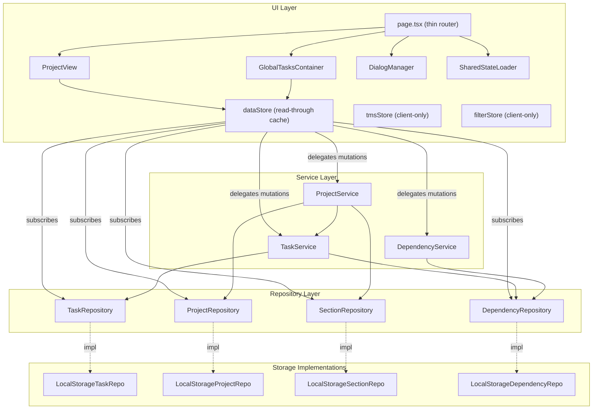
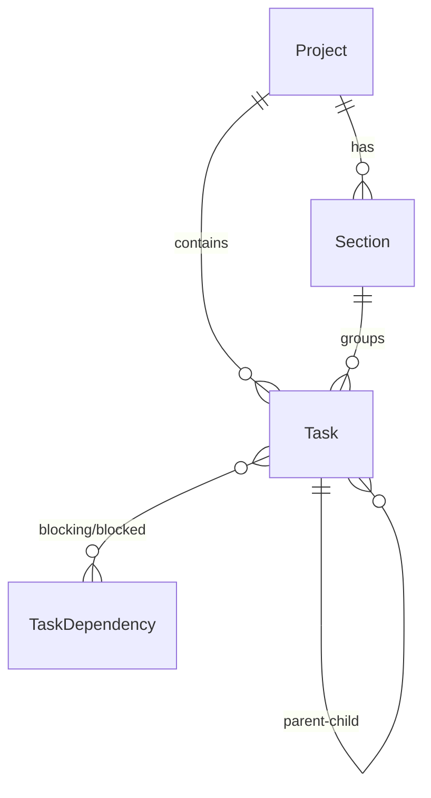
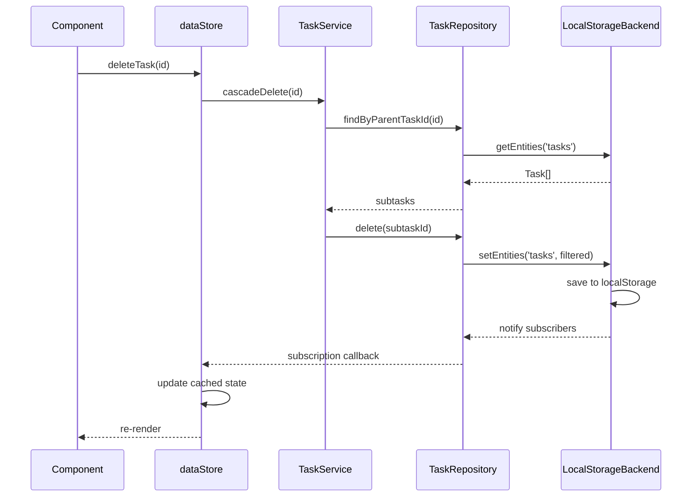

# Design Document: Architecture Refactor

## Overview

This design refactors the task management application from a monolithic architecture (stores with inline business logic, hand-rolled validation, tightly coupled TMS handlers, and an 830-line page component) into a layered architecture with clear separation of concerns:

```
┌─────────────────────────────────────────────┐
│  UI Layer (React Components, Zustand Stores) │
├─────────────────────────────────────────────┤
│  Service Layer (TaskService, ProjectService) │
├─────────────────────────────────────────────┤
│  Repository Layer (per-entity CRUD + subscribe)│
├─────────────────────────────────────────────┤
│  Storage Layer (localStorage / future backends)│
└─────────────────────────────────────────────┘
```

The refactoring is behavior-preserving — no user-facing changes. The app is statically hosted on GitHub Pages via `next export`, so all data persistence remains client-side (localStorage). There is no server-side runtime. The repository pattern enables future migration to IndexedDB or remote APIs, but the initial implementation stays localStorage-only.

The execution order minimizes risk: Zod schemas first (isolated change), then repositories, services, store rewiring, page decomposition, TMS decoupling, TMS disconnection, and finally directory restructuring.

## Architecture



### Key Design Decisions

1. **Repositories store the full blob internally** — The localStorage implementations read/write the full AppState JSON blob but expose entity-level interfaces. This keeps backward compatibility with the existing Zustand persist format while enabling future per-entity storage backends (IndexedDB, remote API, etc.). Since the app is statically hosted on GitHub Pages with no server runtime, all persistence remains client-side.

2. **dataStore becomes a subscriber** — Instead of owning data, dataStore subscribes to repository change events and caches the latest arrays. Components continue using `useDataStore()` hooks unchanged.

3. **Services are plain classes, not singletons** — Services receive repository instances via constructor injection. This makes them testable with mock repositories.

4. **TMS handlers become pure functions** — Instead of classes that import stores, handlers become functions: `(tasks, tmsState) → result`. The call site reads/writes state.

5. **Directory restructuring is last** — Moving files is a large diff with zero logic change. Doing it last avoids merge conflicts during the logic-changing phases.

## Components and Interfaces

### Zod Schemas (`lib/schemas.ts`)

```typescript
import { z } from 'zod';

export const PrioritySchema = z.enum(['none', 'low', 'medium', 'high']);
export const ViewModeSchema = z.enum(['list', 'board', 'calendar']);
export const TimeManagementSystemSchema = z.enum(['none', 'dit', 'af4', 'fvp']);

export const ProjectSchema = z.object({
  id: z.string().uuid(),
  name: z.string().min(1).max(200),
  description: z.string(),
  viewMode: ViewModeSchema,
  createdAt: z.string().datetime(),
  updatedAt: z.string().datetime(),
  color: z.string().optional(),
  icon: z.string().optional(),
});

export const TaskSchema = z.object({
  id: z.string().uuid(),
  projectId: z.string().uuid().nullable(),
  parentTaskId: z.string().uuid().nullable(),
  sectionId: z.string().uuid().nullable(),
  description: z.string().min(1).max(500),
  notes: z.string(),
  assignee: z.string(),
  priority: PrioritySchema,
  tags: z.array(z.string()),
  dueDate: z.string().datetime().nullable(),
  completed: z.boolean(),
  completedAt: z.string().datetime().nullable(),
  order: z.number(),
  createdAt: z.string().datetime(),
  updatedAt: z.string().datetime(),
  comments: z.array(z.any()).optional(),
  attachments: z.array(z.any()).optional(),
  customFields: z.record(z.any()).optional(),
});

export const SectionSchema = z.object({
  id: z.string(),
  projectId: z.string().nullable(),
  name: z.string().min(1).max(100),
  order: z.number(),
  collapsed: z.boolean(),
  createdAt: z.string().datetime(),
  updatedAt: z.string().datetime(),
});

export const TaskDependencySchema = z.object({
  id: z.string().uuid(),
  blockingTaskId: z.string().uuid(),
  blockedTaskId: z.string().uuid(),
  createdAt: z.string().datetime(),
});

export const TMSStateSchema = z.object({
  activeSystem: TimeManagementSystemSchema,
  dit: z.object({
    todayTasks: z.array(z.string()),
    tomorrowTasks: z.array(z.string()),
    lastDayChange: z.string().datetime(),
  }),
  af4: z.object({
    markedTasks: z.array(z.string()),
    markedOrder: z.array(z.string()),
  }),
  fvp: z.object({
    dottedTasks: z.array(z.string()),
    currentX: z.string().nullable(),
    selectionInProgress: z.boolean(),
  }),
});

export const AppSettingsSchema = z.object({
  activeProjectId: z.string().uuid().nullable(),
  timeManagementSystem: TimeManagementSystemSchema,
  showOnlyActionableTasks: z.boolean(),
  theme: z.enum(['light', 'dark', 'system']),
  notifications: z.boolean().optional(),
  defaultPriority: PrioritySchema.optional(),
});

export const AppStateSchema = z.object({
  projects: z.array(ProjectSchema),
  tasks: z.array(TaskSchema),
  sections: z.array(SectionSchema),
  dependencies: z.array(TaskDependencySchema),
  tmsState: TMSStateSchema,
  settings: AppSettingsSchema,
  version: z.string(),
});

// Derive types from schemas
export type Project = z.infer<typeof ProjectSchema>;
export type Task = z.infer<typeof TaskSchema>;
export type Section = z.infer<typeof SectionSchema>;
export type TaskDependency = z.infer<typeof TaskDependencySchema>;
export type TMSState = z.infer<typeof TMSStateSchema>;
export type AppSettings = z.infer<typeof AppSettingsSchema>;
export type AppState = z.infer<typeof AppStateSchema>;
```

Note: Section IDs use `z.string()` (not `z.string().uuid()`) because the current codebase generates section IDs with a `${projectId}-section-todo` pattern, not UUIDs.

### Repository Interfaces (`lib/repositories/types.ts`)

```typescript
import { UUID } from '@/types';

export type SubscriptionCallback<T> = (items: T[]) => void;
export type Unsubscribe = () => void;

export interface Repository<T extends { id: string }> {
  findById(id: UUID): T | undefined;
  findAll(): T[];
  create(item: T): void;
  update(id: UUID, updates: Partial<T>): void;
  delete(id: UUID): void;
  subscribe(callback: SubscriptionCallback<T>): Unsubscribe;
}

export interface TaskRepository extends Repository<Task> {
  findByProjectId(projectId: UUID): Task[];
  findByParentTaskId(parentTaskId: UUID): Task[];
}

export interface ProjectRepository extends Repository<Project> {}

export interface SectionRepository extends Repository<Section> {
  findByProjectId(projectId: UUID | null): Section[];
}

export interface DependencyRepository extends Repository<TaskDependency> {
  findByBlockingTaskId(taskId: UUID): TaskDependency[];
  findByBlockedTaskId(taskId: UUID): TaskDependency[];
}
```

### LocalStorage Repository Implementation Strategy

Each localStorage repository implementation shares a single backing store (the AppState JSON blob in localStorage). A `LocalStorageBackend` class manages read/write of the full blob and notifies individual repositories when data changes:

```typescript
// lib/repositories/localStorageBackend.ts
class LocalStorageBackend {
  private state: AppState;
  private listeners: Map<string, Set<() => void>>;

  load(): AppState { /* parse from localStorage, validate with Zod */ }
  save(): void { /* serialize to localStorage */ }
  getEntities<K extends keyof AppState>(key: K): AppState[K];
  setEntities<K extends keyof AppState>(key: K, value: AppState[K]): void;
  onEntityChange(key: string, callback: () => void): Unsubscribe;
}
```

Each repository (e.g., `LocalStorageTaskRepository`) holds a reference to the shared backend and delegates reads/writes through it. Mutations call `backend.setEntities(...)` which triggers `backend.save()` and notifies subscribers.

### Service Layer

```typescript
// lib/services/taskService.ts
class TaskService {
  constructor(
    private taskRepo: TaskRepository,
    private depRepo: DependencyRepository
  ) {}

  cascadeDelete(taskId: UUID): void {
    // Recursively find and delete subtasks
    // Delete associated dependencies
  }

  cascadeComplete(taskId: UUID, completed: boolean): void {
    // Update task completion
    // Optionally cascade to subtasks
  }
}

// lib/services/projectService.ts
class ProjectService {
  constructor(
    private projectRepo: ProjectRepository,
    private sectionRepo: SectionRepository,
    private taskService: TaskService
  ) {}

  createWithDefaults(project: Project): void {
    // Create project
    // Create default sections (To Do, Doing, Done)
  }

  cascadeDelete(projectId: UUID): void {
    // Delete all tasks via TaskService
    // Delete all sections
    // Delete project
  }
}

// lib/services/dependencyService.ts
class DependencyService {
  constructor(
    private depRepo: DependencyRepository,
    private resolver: DependencyResolver
  ) {}

  addDependency(dep: TaskDependency, tasks: Task[]): void {
    // Check circular dependency via resolver
    // Create via repository
  }
}
```

### Page Decomposition

```typescript
// app/page.tsx — thin router
function HomeContent() {
  // URL params, DialogManager, SharedStateLoader
  // Routes to: ProjectView | GlobalTasksContainer | landing
}

// components/ProjectView.tsx
function ProjectView({ projectId }: { projectId: string }) {
  // Tab routing (overview, list, board, calendar)
  // Task CRUD callbacks delegated to dataStore
}

// components/GlobalTasksContainer.tsx
function GlobalTasksContainer() {
  // GlobalTasksHeader + GlobalTasksView
  // Display mode toggle (nested/flat)
}

// lib/hooks/useDialogManager.ts
function useDialogManager() {
  // Manages: projectDialog, taskDialog, dependencyDialog,
  //          sharedStateDialog, taskDetailPanel
  // Returns: state + open/close handlers
}

// lib/hooks/useSharedStateLoader.ts
function useSharedStateLoader() {
  // On mount: parse URL hash, decompress, validate, show dialog
}
```

### TMS Handler Decoupling

Current (coupled):
```typescript
class DITHandler {
  getOrderedTasks(tasks: Task[]): Task[] {
    const state = useTMSStore.getState().state; // direct store import
    // ...
  }
}
```

Refactored (pure):
```typescript
// lib/tms/DITHandler.ts
export function getOrderedTasks(tasks: Task[], ditState: DITState): Task[] {
  const todayIds = new Set(ditState.todayTasks);
  const tomorrowIds = new Set(ditState.tomorrowTasks);
  // ... pure computation, no store access
}

export function onTaskCompleted(task: Task, ditState: DITState): Partial<DITState> {
  // Returns state delta, doesn't write to store
}

export function initialize(tasks: Task[], ditState: DITState): Partial<DITState> {
  // Returns state delta for day rollover if needed
}
```

## Data Models

The data models remain structurally identical to the current `types/index.ts` definitions. The change is that types are now derived from Zod schemas via `z.infer<>` rather than manually defined interfaces.

### Entity Relationships



### Migration Strategy

No data migration is needed. The Zod schemas validate the same shape as the current hand-rolled validators. The localStorage keys and JSON structure remain identical. The `version` field stays at `"1.0.0"`.

### Repository Data Flow




## Correctness Properties

*A property is a characteristic or behavior that should hold true across all valid executions of a system — essentially, a formal statement about what the system should do. Properties serve as the bridge between human-readable specifications and machine-verifiable correctness guarantees.*

### Property 1: Zod validation rejects invalid data on load

*For any* object that does not conform to the AppState Zod schema, calling the storage adapter's load method with that object in localStorage SHALL return null.

**Validates: Requirements 1.3**

### Property 2: Zod validation rejects invalid data on import

*For any* JSON string that does not represent a valid AppState according to the Zod schema, calling importFromJSON SHALL throw an ImportError.

**Validates: Requirements 1.4**

### Property 3: Repository create-read round-trip

*For any* valid entity (Task, Project, Section, or TaskDependency), creating it via the corresponding repository and then calling findById with its ID SHALL return an entity equivalent to the original.

**Validates: Requirements 2.5, 2.7, 2.8**

### Property 4: Repository subscriber notification

*For any* sequence of N mutations (create, update, delete) on a repository with a registered subscriber, the subscriber callback SHALL be invoked exactly N times.

**Validates: Requirements 2.6**

### Property 5: TaskService cascade delete removes all descendants

*For any* task tree (a task with arbitrarily nested subtasks), calling TaskService.cascadeDelete on the root task SHALL result in zero remaining tasks from that tree and zero dependencies referencing any deleted task.

**Validates: Requirements 3.4**

### Property 6: ProjectService cascade delete removes all project entities

*For any* project with associated tasks, sections, and dependencies, calling ProjectService.cascadeDelete SHALL result in zero remaining tasks, sections, or dependencies belonging to that project.

**Validates: Requirements 3.5**

### Property 7: ProjectService create produces default sections

*For any* valid project, calling ProjectService.createWithDefaults SHALL result in exactly three sections with names "To Do", "Doing", and "Done" associated with that project.

**Validates: Requirements 3.6**

### Property 8: Store-repository synchronization

*For any* mutation performed through a repository, the dataStore's cached state for that entity type SHALL equal the repository's findAll() result after the mutation completes.

**Validates: Requirements 4.1, 4.5**

### Property 9: TMS getOrderedTasks returns a permutation

*For any* array of tasks and valid TMS state, calling a TMS handler's getOrderedTasks SHALL return an array that is a permutation of the input (same elements, same length, possibly different order).

**Validates: Requirements 6.1**

### Property 10: TMS task lifecycle handlers return valid state

*For any* task and valid TMS state, calling onTaskCompleted or onTaskCreated SHALL return a partial TMS state object that, when merged with the original state, produces a valid TMSState according to the Zod schema.

**Validates: Requirements 6.2, 6.3**

### Property 11: TMS initialize returns valid state

*For any* array of tasks and valid TMS state, calling initialize SHALL return a partial TMS state object that, when merged with the original state, produces a valid TMSState according to the Zod schema.

**Validates: Requirements 6.4**

## Error Handling

### Storage Errors

- **localStorage quota exceeded**: Throw `StorageError` with descriptive message (existing behavior, preserved)
- **Corrupted localStorage data**: Zod validation fails → `load()` returns null, app starts with empty state
- **Invalid import JSON**: Zod validation fails → throw `ImportError` with Zod error details

### Repository Errors

- **Entity not found on update/delete**: No-op (silent skip), consistent with current Zustand behavior
- **Duplicate ID on create**: Overwrite existing entity (last-write-wins), consistent with current behavior

### Service Errors

- **Cascade delete of non-existent task/project**: No-op, services check existence before cascading
- **Circular dependency detection**: `DependencyService.addDependency` throws if `DependencyResolver.hasCircularDependency` returns true (existing behavior, preserved)

### Validation Errors

- **Invalid input to validation functions**: Continue throwing `ValidationError` (existing behavior in `lib/validation.ts`)
- **Zod parse errors**: Caught internally by storage/repository layer, surfaced as `StorageError` or `ImportError`

## Testing Strategy

### Testing Framework

- **Test runner**: Vitest (already configured)
- **Property-based testing**: fast-check (already in devDependencies)
- **Component testing**: @testing-library/react (already in devDependencies)
- **DOM environment**: jsdom (already configured)

### Dual Testing Approach

**Unit tests** cover:
- Specific examples demonstrating correct behavior (e.g., creating a project produces expected sections)
- Edge cases (empty arrays, null IDs, maximum-length strings)
- Error conditions (invalid JSON, quota exceeded)
- Integration points between services and repositories

**Property-based tests** cover:
- All 11 correctness properties defined above
- Each property test runs a minimum of 100 iterations
- Each test is tagged with: `Feature: architecture-refactor, Property {N}: {title}`

### Test Migration Strategy

Existing tests must continue passing throughout the refactoring. The approach:

1. **Preserve existing tests initially** — Don't delete any test files during early phases (Zod, repositories, services). Run `vitest run` after each phase to confirm no regressions.
2. **Migrate tests incrementally** — As stores are rewired (phase 4), update `stores/dataStore.test.ts` to test through the new service/repository layer. Existing assertions should still hold since behavior is preserved.
3. **Adapt TMS handler tests** — When handlers become pure functions (phase 6), update `lib/tms/*.test.ts` to pass state as arguments instead of mocking store imports. The test assertions remain the same.
4. **Update import paths last** — When directory restructuring happens (phase 8), update all test import paths. Run full test suite to confirm.

### Test Organization

Tests are co-located with their source files:
- `lib/schemas.test.ts` — Zod schema validation properties (Properties 1, 2)
- `lib/repositories/localStorage.test.ts` — Repository round-trip and subscriber properties (Properties 3, 4)
- `lib/services/taskService.test.ts` — Cascade delete property (Property 5)
- `lib/services/projectService.test.ts` — Cascade delete and default sections properties (Properties 6, 7)
- `stores/dataStore.test.ts` — Store-repository sync property (Property 8)
- `lib/tms/handlers.test.ts` — TMS handler properties (Properties 9, 10, 11)

### Property Test Configuration

```typescript
import fc from 'fast-check';

// Minimum 100 iterations per property
const PROPERTY_CONFIG = { numRuns: 100 };

// Example property test structure
describe('TaskRepository', () => {
  it('Property 3: Repository create-read round-trip', () => {
    // Feature: architecture-refactor, Property 3: Repository create-read round-trip
    fc.assert(
      fc.property(
        taskArbitrary,
        (task) => {
          const repo = new LocalStorageTaskRepository(backend);
          repo.create(task);
          const found = repo.findById(task.id);
          expect(found).toEqual(task);
        }
      ),
      PROPERTY_CONFIG
    );
  });
});
```

### Generators (Arbitraries)

Custom fast-check arbitraries for domain types:
- `projectArbitrary` — generates valid Project objects
- `taskArbitrary` — generates valid Task objects with nullable fields
- `sectionArbitrary` — generates valid Section objects
- `dependencyArbitrary` — generates valid TaskDependency objects
- `tmsStateArbitrary` — generates valid TMSState objects
- `taskTreeArbitrary` — generates a root task with nested subtasks (for cascade delete testing)
- `invalidAppStateArbitrary` — generates objects that fail AppState validation (for error path testing)
