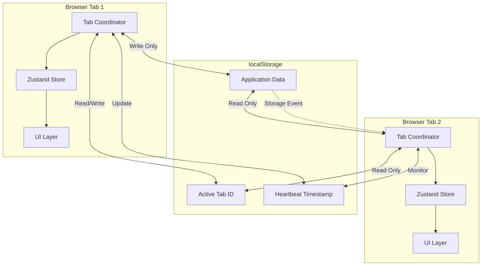
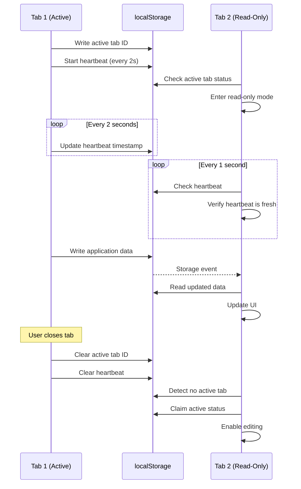

# Design Document: Multi-Tab Synchronization

## Overview

This design implements a multi-tab synchronization system for a Next.js task management application using localStorage. The system prevents race conditions by designating one tab as the "active" editor while keeping other tabs in read-only mode with automatic synchronization.

The design uses a heartbeat-based coordination mechanism where the active tab periodically signals its liveness. Read-only tabs monitor this heartbeat and automatically promote themselves when the active tab closes or becomes unresponsive.

## Architecture

### High-Level Architecture



### Component Interaction Flow



## Components and Interfaces

### TabCoordinator

The core component responsible for managing tab synchronization state.

```typescript
interface TabCoordinatorConfig {
  heartbeatInterval: number;      // Default: 2000ms
  heartbeatTimeout: number;       // Default: 5000ms
  monitorInterval: number;        // Default: 1000ms
}

interface TabState {
  tabId: string;
  isActive: boolean;
  lastHeartbeat: number | null;
}

class TabCoordinator {
  private tabId: string;
  private config: TabCoordinatorConfig;
  private heartbeatTimer: NodeJS.Timeout | null;
  private monitorTimer: NodeJS.Timeout | null;
  private storageListener: ((e: StorageEvent) => void) | null;
  
  constructor(config?: Partial<TabCoordinatorConfig>);
  
  // Lifecycle methods
  initialize(): void;
  cleanup(): void;
  
  // Active tab management
  private attemptBecomeActive(): boolean;
  private startHeartbeat(): void;
  private stopHeartbeat(): void;
  private updateHeartbeat(): void;
  
  // Monitoring
  private startMonitoring(): void;
  private stopMonitoring(): void;
  private checkActiveTabStatus(): void;
  private isHeartbeatStale(): boolean;
  
  // State queries
  getTabState(): TabState;
  isActiveTab(): boolean;
  
  // Force takeover
  forceTakeover(): void;
  
  // Event handlers
  private handleStorageChange(event: StorageEvent): void;
  private handleBeforeUnload(): void;
  private handleVisibilityChange(): void;
}
```

### LocalStorage Schema

```typescript
interface TabCoordinationData {
  activeTabId: string | null;
  heartbeatTimestamp: number | null;
  lastActiveTabId: string | null;  // For debugging
}

// localStorage keys
const STORAGE_KEYS = {
  ACTIVE_TAB_ID: 'tab-sync:active-tab-id',
  HEARTBEAT: 'tab-sync:heartbeat',
  LAST_ACTIVE: 'tab-sync:last-active-tab-id'
} as const;
```

### Zustand Store Integration

```typescript
interface TabSyncState {
  isActiveTab: boolean;
  isReadOnly: boolean;
  canEdit: boolean;
  lastSyncTime: number | null;
}

interface TabSyncActions {
  setActiveStatus(isActive: boolean): void;
  syncFromStorage(): void;
  forceTakeover(): void;
}

type TabSyncStore = TabSyncState & TabSyncActions;

// Store creation with persist middleware
const useTabSyncStore = create<TabSyncStore>()(
  persist(
    (set, get) => ({
      // State
      isActiveTab: false,
      isReadOnly: true,
      canEdit: false,
      lastSyncTime: null,
      
      // Actions
      setActiveStatus: (isActive) => set({
        isActiveTab: isActive,
        isReadOnly: !isActive,
        canEdit: isActive
      }),
      
      syncFromStorage: () => {
        // Reload data from localStorage
        // Update lastSyncTime
      },
      
      forceTakeover: () => {
        // Trigger coordinator to force takeover
      }
    }),
    {
      name: 'tab-sync-storage',
      // Only persist certain fields
      partialize: (state) => ({
        lastSyncTime: state.lastSyncTime
      })
    }
  )
);
```

### UI Components

```typescript
// ReadOnlyBanner component
interface ReadOnlyBannerProps {
  onTakeControl: () => void;
}

const ReadOnlyBanner: React.FC<ReadOnlyBannerProps> = ({ onTakeControl }) => {
  // Display banner with "Take control" button
};

// ActiveTabIndicator component
const ActiveTabIndicator: React.FC = () => {
  // Display subtle indicator that this tab is active
};

// TabSyncProvider component
interface TabSyncProviderProps {
  children: React.ReactNode;
  config?: Partial<TabCoordinatorConfig>;
}

const TabSyncProvider: React.FC<TabSyncProviderProps> = ({ 
  children, 
  config 
}) => {
  // Initialize TabCoordinator
  // Provide context to children
  // Render ReadOnlyBanner or ActiveTabIndicator based on state
};
```

## Data Models

### Tab Identification

Each tab generates a unique identifier on initialization:

```typescript
function generateTabId(): string {
  return `tab-${Date.now()}-${Math.random().toString(36).substr(2, 9)}`;
}
```

### Heartbeat Data Structure

```typescript
interface HeartbeatData {
  tabId: string;
  timestamp: number;
}

function serializeHeartbeat(data: HeartbeatData): string {
  return JSON.stringify(data);
}

function deserializeHeartbeat(json: string): HeartbeatData | null {
  try {
    return JSON.parse(json);
  } catch {
    return null;
  }
}
```

### Election Algorithm

When multiple tabs attempt to become active simultaneously, use timestamp-based election:

```typescript
function attemptElection(tabId: string): boolean {
  const now = Date.now();
  const electionKey = 'tab-sync:election';
  
  // Try to claim election slot
  const existingElection = localStorage.getItem(electionKey);
  
  if (!existingElection) {
    // No election in progress, claim it
    localStorage.setItem(electionKey, JSON.stringify({
      tabId,
      timestamp: now
    }));
    
    // Wait a small random delay to allow other tabs to compete
    const delay = Math.random() * 100;
    
    // After delay, check if we still own the election
    setTimeout(() => {
      const currentElection = localStorage.getItem(electionKey);
      if (currentElection) {
        const data = JSON.parse(currentElection);
        if (data.tabId === tabId) {
          // We won the election
          becomeActive();
        }
      }
    }, delay);
    
    return true;
  }
  
  return false;
}
```

## Correctness Properties

*A property is a characteristic or behavior that should hold true across all valid executions of a system—essentially, a formal statement about what the system should do. Properties serve as the bridge between human-readable specifications and machine-verifiable correctness guarantees.*


### Property 1: Single Active Tab Invariant
*For any* point in time across all browser tabs, at most one tab should have active status in localStorage.
**Validates: Requirements 1.4**

### Property 2: New Tab Becomes Read-Only When Active Tab Exists
*For any* new tab initialization, if an active tab already exists in localStorage, the new tab should be designated as read-only.
**Validates: Requirements 1.2**

### Property 3: Active Tab Storage Persistence
*For any* tab that becomes active, localStorage should immediately contain both the tab identifier and a valid timestamp.
**Validates: Requirements 1.3**

### Property 4: Heartbeat Update Interval
*For any* active tab, heartbeat timestamps in localStorage should be updated at intervals of approximately 2 seconds (±200ms tolerance).
**Validates: Requirements 2.1**

### Property 5: Heartbeat Data Completeness
*For any* heartbeat update, the persisted data should contain both a valid tab identifier and a current timestamp.
**Validates: Requirements 2.2, 2.3**

### Property 6: Active Tab Cleanup on Close
*For any* active tab that closes, both the active tab identifier and heartbeat timestamp should be removed from localStorage during beforeunload.
**Validates: Requirements 3.1, 3.2**

### Property 7: Heartbeat Monitoring Interval
*For any* read-only tab, heartbeat status checks should occur at intervals of approximately 1 second (±200ms tolerance).
**Validates: Requirements 4.1**

### Property 8: Stale Heartbeat Detection
*For any* heartbeat timestamp, if it is older than 5 seconds from the current time, it should be classified as stale.
**Validates: Requirements 4.2**

### Property 9: Promotion on Stale Heartbeat
*For any* read-only tab that detects a stale heartbeat, it should initiate the promotion process to become active.
**Validates: Requirements 4.3, 5.1**

### Property 10: Election Uniqueness
*For any* scenario where multiple read-only tabs simultaneously attempt promotion, exactly one tab should successfully become active.
**Validates: Requirements 5.2**

### Property 11: Post-Promotion State Consistency
*For any* tab that successfully completes promotion, it should both start sending heartbeat signals and have editing capabilities enabled.
**Validates: Requirements 5.3, 5.4**

### Property 12: Storage Event Synchronization
*For any* storage event received by a read-only tab, the tab should reload data from localStorage and update its UI within 500 milliseconds.
**Validates: Requirements 6.2, 6.3, 6.4**

### Property 13: UI State Matches Tab Status
*For any* tab, the UI should display read-only indicators (banner and disabled controls) when the tab is read-only, and active indicators (active badge and enabled controls) when the tab is active.
**Validates: Requirements 7.1, 7.2, 7.3, 7.4**

### Property 14: Take Control Button Presence
*For any* tab in read-only mode, a "Take control" button should be visible in the UI.
**Validates: Requirements 8.1**

### Property 15: Force Takeover Execution
*For any* user-initiated force takeover action, the tab should claim active status and update localStorage regardless of existing active tab state.
**Validates: Requirements 8.2, 8.3, 8.4**

### Property 16: Write Operation Exclusivity
*For any* write operation to application data in localStorage, it should only be executed by a tab that has active status.
**Validates: Requirements 9.1, 9.2, 9.3, 9.4**

### Property 17: Monitoring Persistence During Visibility Changes
*For any* tab that becomes hidden, monitoring for active tab changes should continue without interruption.
**Validates: Requirements 10.1**

### Property 18: Status Verification on Visibility
*For any* tab that becomes visible, it should verify its active status is still valid and promote itself if necessary.
**Validates: Requirements 10.2, 10.3**

### Property 19: Heartbeat Continuity During Visibility Changes
*For any* active tab experiencing visibility changes, heartbeat updates should continue without disruption.
**Validates: Requirements 10.4**

## Error Handling

### localStorage Unavailable

If localStorage is unavailable (private browsing, quota exceeded, or disabled):

```typescript
function isLocalStorageAvailable(): boolean {
  try {
    const test = '__localStorage_test__';
    localStorage.setItem(test, test);
    localStorage.removeItem(test);
    return true;
  } catch {
    return false;
  }
}

// Fallback behavior
if (!isLocalStorageAvailable()) {
  // Treat all tabs as active (no coordination)
  // Display warning to user about multi-tab limitations
  console.warn('localStorage unavailable - multi-tab sync disabled');
}
```

### Corrupted localStorage Data

Handle cases where localStorage contains invalid data:

```typescript
function safeGetItem<T>(key: string, validator: (data: any) => data is T): T | null {
  try {
    const item = localStorage.getItem(key);
    if (!item) return null;
    
    const parsed = JSON.parse(item);
    if (validator(parsed)) {
      return parsed;
    }
    
    // Invalid data, clear it
    localStorage.removeItem(key);
    return null;
  } catch {
    // Parse error, clear corrupted data
    localStorage.removeItem(key);
    return null;
  }
}
```

### Race Condition During Election

If two tabs write to localStorage simultaneously during election:

```typescript
function attemptElectionWithRetry(tabId: string, maxRetries: number = 3): boolean {
  for (let attempt = 0; attempt < maxRetries; attempt++) {
    if (attemptElection(tabId)) {
      return true;
    }
    
    // Wait with exponential backoff
    const delay = Math.pow(2, attempt) * 100;
    await sleep(delay);
  }
  
  return false;
}
```

### Heartbeat Timestamp Drift

Handle cases where system clock changes:

```typescript
function isHeartbeatValid(heartbeat: HeartbeatData): boolean {
  const now = Date.now();
  const age = now - heartbeat.timestamp;
  
  // Reject heartbeats from the future (clock drift)
  if (age < -1000) {
    console.warn('Heartbeat timestamp is in the future');
    return false;
  }
  
  // Reject stale heartbeats
  if (age > 5000) {
    return false;
  }
  
  return true;
}
```

### Cleanup Failure

If beforeunload cleanup fails (browser crash, force quit):

- Read-only tabs will detect stale heartbeat after 5 seconds
- Automatic promotion ensures system recovers
- No manual intervention required

### Storage Event Not Fired

In some browsers, storage events may not fire reliably:

```typescript
// Fallback polling for browsers with unreliable storage events
function startFallbackPolling() {
  setInterval(() => {
    if (!isActiveTab()) {
      // Manually check for data changes
      const currentData = readFromStorage();
      if (hasDataChanged(currentData)) {
        syncFromStorage();
      }
    }
  }, 2000); // Poll every 2 seconds
}
```

## Testing Strategy

### Dual Testing Approach

This feature requires both unit tests and property-based tests to ensure comprehensive coverage:

- **Unit tests**: Verify specific examples, edge cases, and error conditions
- **Property tests**: Verify universal properties across all inputs through randomization

Unit tests should focus on:
- Specific scenarios like first tab opening, tab closing, force takeover
- Integration between TabCoordinator and Zustand store
- Error conditions (localStorage unavailable, corrupted data)
- Edge cases (clock drift, simultaneous elections)

Property tests should focus on:
- Universal invariants (single active tab, write exclusivity)
- Timing properties (heartbeat intervals, synchronization delays)
- State transitions (promotion, cleanup, status changes)
- Comprehensive input coverage through randomization

### Property-Based Testing Configuration

**Testing Library**: Use `fast-check` for TypeScript property-based testing

**Configuration**:
- Minimum 100 iterations per property test
- Each test must reference its design document property
- Tag format: `Feature: multi-tab-sync, Property {number}: {property_text}`

**Example Test Structure**:

```typescript
import fc from 'fast-check';

describe('TabCoordinator Properties', () => {
  // Feature: multi-tab-sync, Property 1: Single Active Tab Invariant
  it('should maintain at most one active tab at any time', () => {
    fc.assert(
      fc.property(
        fc.array(fc.string(), { minLength: 2, maxLength: 10 }), // Tab IDs
        (tabIds) => {
          // Initialize multiple coordinators
          const coordinators = tabIds.map(id => new TabCoordinator(id));
          
          // Simulate concurrent initialization
          coordinators.forEach(c => c.initialize());
          
          // Count active tabs
          const activeTabs = coordinators.filter(c => c.isActiveTab());
          
          // At most one should be active
          expect(activeTabs.length).toBeLessThanOrEqual(1);
        }
      ),
      { numRuns: 100 }
    );
  });
  
  // Feature: multi-tab-sync, Property 8: Stale Heartbeat Detection
  it('should detect heartbeats older than 5 seconds as stale', () => {
    fc.assert(
      fc.property(
        fc.integer({ min: 0, max: 10000 }), // Heartbeat age in ms
        (age) => {
          const heartbeat = {
            tabId: 'test-tab',
            timestamp: Date.now() - age
          };
          
          const isStale = age > 5000;
          expect(isHeartbeatStale(heartbeat)).toBe(isStale);
        }
      ),
      { numRuns: 100 }
    );
  });
});
```

### Test Environment Setup

```typescript
// Mock localStorage for testing
class MockLocalStorage {
  private store: Map<string, string> = new Map();
  private listeners: ((event: StorageEvent) => void)[] = [];
  
  getItem(key: string): string | null {
    return this.store.get(key) ?? null;
  }
  
  setItem(key: string, value: string): void {
    const oldValue = this.store.get(key);
    this.store.set(key, value);
    
    // Simulate storage event
    this.listeners.forEach(listener => {
      listener(new StorageEvent('storage', {
        key,
        oldValue: oldValue ?? null,
        newValue: value,
        storageArea: this as any
      }));
    });
  }
  
  removeItem(key: string): void {
    this.store.delete(key);
  }
  
  clear(): void {
    this.store.clear();
  }
  
  addEventListener(type: string, listener: (e: StorageEvent) => void): void {
    if (type === 'storage') {
      this.listeners.push(listener);
    }
  }
  
  removeEventListener(type: string, listener: (e: StorageEvent) => void): void {
    const index = this.listeners.indexOf(listener);
    if (index > -1) {
      this.listeners.splice(index, 1);
    }
  }
}

// Setup for tests
beforeEach(() => {
  global.localStorage = new MockLocalStorage() as any;
});
```

### Integration Testing

Test the complete flow with multiple simulated tabs:

```typescript
describe('Multi-Tab Integration', () => {
  it('should handle tab lifecycle correctly', async () => {
    // Create first tab (should become active)
    const tab1 = new TabCoordinator();
    tab1.initialize();
    expect(tab1.isActiveTab()).toBe(true);
    
    // Create second tab (should be read-only)
    const tab2 = new TabCoordinator();
    tab2.initialize();
    expect(tab2.isActiveTab()).toBe(false);
    
    // Close first tab
    tab1.cleanup();
    
    // Wait for second tab to detect and promote
    await sleep(6000); // Heartbeat timeout + buffer
    expect(tab2.isActiveTab()).toBe(true);
  });
});
```

### Performance Testing

Verify timing requirements:

```typescript
describe('Timing Properties', () => {
  it('should update heartbeat every 2 seconds', async () => {
    const coordinator = new TabCoordinator();
    coordinator.initialize();
    
    const timestamps: number[] = [];
    
    // Collect heartbeat timestamps
    for (let i = 0; i < 5; i++) {
      await sleep(2000);
      const heartbeat = getHeartbeatFromStorage();
      timestamps.push(heartbeat.timestamp);
    }
    
    // Verify intervals are approximately 2 seconds
    for (let i = 1; i < timestamps.length; i++) {
      const interval = timestamps[i] - timestamps[i - 1];
      expect(interval).toBeGreaterThanOrEqual(1800);
      expect(interval).toBeLessThanOrEqual(2200);
    }
  });
});
```
