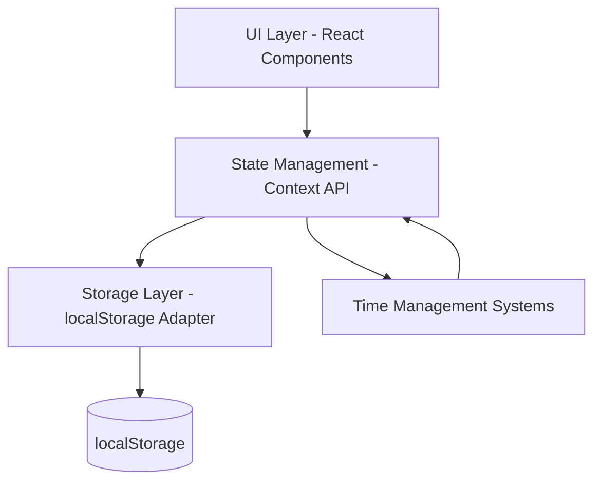
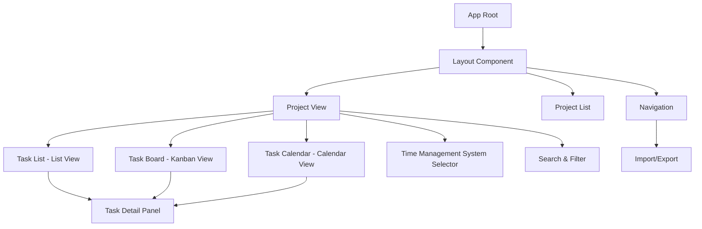
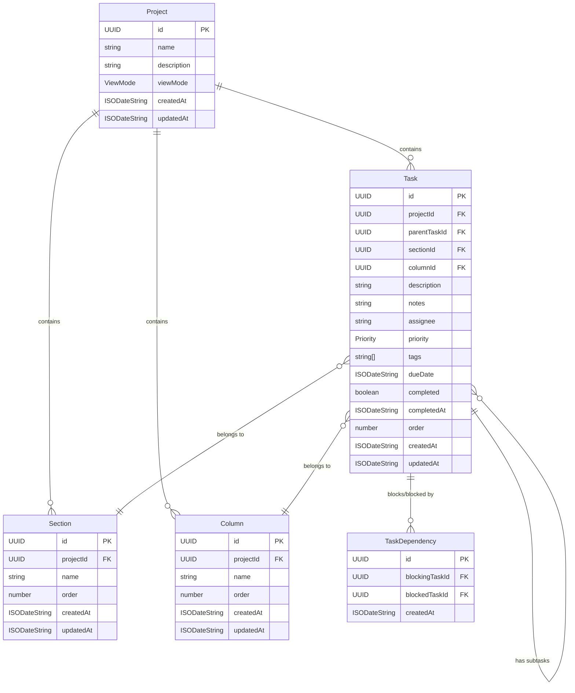

# Design Document: Task Management Web App

## Overview

The Task Management Web App is a single-user, client-side application built with Next.js 14, TypeScript, shadcn/ui, and Tailwind CSS. It provides Asana-inspired project and task management capabilities combined with four distinct time management methodologies (DIT, AF4, FVP, and Standard mode). The application uses localStorage for data persistence and supports static export for GitHub Pages hosting.

### Key Design Principles

1. **Client-Side First**: All logic runs in the browser with no server dependencies
2. **Type Safety**: Comprehensive TypeScript interfaces for all data structures
3. **Extensibility**: Data models designed to accommodate future features
4. **Performance**: Efficient localStorage operations with optimistic UI updates
5. **Responsive**: Mobile-first design that scales to desktop
6. **Accessibility**: WCAG 2.1 AA compliant UI components

### Technology Stack

- **Framework**: Next.js 14 (App Router, static export)
- **Language**: TypeScript 5.x
- **UI Components**: shadcn/ui (Radix UI primitives)
- **Styling**: Tailwind CSS 3.x
- **State Management**: Zustand + localStorage middleware
- **Date Handling**: date-fns
- **Icons**: Lucide React
- **Testing**: Vitest + React Testing Library + fast-check (property-based testing)

## Architecture

### High-Level Architecture



### Component Architecture



### State Management Architecture

The application uses Zustand for state management with the following stores:

1. **useAppStore**: Global application state (active project, view mode, TMS)
2. **useDataStore**: All data (projects, tasks, sections, columns, dependencies)
3. **useTMSStore**: Time management system state (marks, dots, scheduled dates)
4. **useFilterStore**: Search and filter state

Each store provides:
- State values
- Action methods (create, update, delete)
- Computed/derived selectors
- localStorage persistence via Zustand middleware

### View Mode and Time Management System Interaction

**Design Decision**: View modes (List, Board, Calendar) and Time Management Systems (DIT, AF4, FVP) are mutually exclusive display modes.

**Rationale**:
- TMS views have specialized layouts optimized for their specific workflows
- Combining TMS logic with standard view modes would create confusing hybrid interfaces
- Each TMS needs full control over task presentation to implement its methodology correctly

**Implementation**:
- When `timeManagementSystem === NONE`: Display view mode selector, render based on `project.viewMode`
- When `timeManagementSystem !== NONE`: Hide view mode selector, render TMS-specific view
- View mode preference is preserved per project and restored when switching back to NONE

**User Experience**:
- Clear separation: Users either use a TMS or choose a view mode, never both simultaneously
- No confusion: View mode controls are hidden when not applicable
- Preserved preferences: Switching TMS doesn't lose view mode settings

### Project Routing Architecture

**Design Decision**: Use query parameter routing to provide shareable project URLs while maintaining static export compatibility.

**Rationale**:
- Static export requirement eliminates server-side routing and dynamic routes
- Query parameters work perfectly with static HTML files
- No additional dependencies required (uses Next.js built-in `useSearchParams`)
- Simple implementation with minimal code changes
- Browser back/forward navigation works automatically

**URL Structure**:
- `/` - Project list view (no query parameter)
- `/?project=<project-id>` - Specific project view

**Implementation**:
```typescript
// In app/page.tsx
'use client';

import { useSearchParams, useRouter } from 'next/navigation';

export default function Home() {
  const searchParams = useSearchParams();
  const router = useRouter();
  const projectId = searchParams.get('project');
  
  // If projectId exists and is valid, show project view
  // Otherwise show project list
  
  if (projectId) {
    const project = getProjectById(projectId);
    if (!project) {
      // Invalid project ID, redirect to list
      router.push('/');
      return null;
    }
    return <ProjectView projectId={projectId} />;
  }
  
  return <ProjectList />;
}
```

**Navigation Flow**:
1. User clicks project in list → `router.push(\`/?project=\${id}\`)`
2. URL updates → `useSearchParams()` detects change
3. Component re-renders with project view
4. Browser back button → Returns to project list
5. Share URL → Recipient sees same project

**Error Handling**:
- Invalid project ID → Redirect to project list
- Missing project data → Show error message and link to list
- Malformed URL → Gracefully fall back to project list

**Benefits**:
- ✅ Shareable URLs for specific projects
- ✅ Browser back/forward navigation works
- ✅ Bookmarkable project pages
- ✅ Works with static export (no server required)
- ✅ No additional dependencies
- ✅ Simple implementation (~50 lines of code)

**Trade-offs**:
- URLs are less semantic (`/?project=123` vs `/project/123`)
- All routing logic in single page component
- Query parameters visible in URL bar

These trade-offs are acceptable given the static export requirement and the simplicity gained.

### Inline Editing Architecture

**Design Decision**: Implement inline editing for project names and task descriptions using a controlled input pattern with local state management.

**Rationale**:
- Faster editing workflow - no need to open dialogs or sidebars
- Reduces UI clutter and cognitive load
- Familiar pattern used in modern task management apps (Asana, Todoist, etc.)
- Maintains data integrity with validation before save
- Provides clear visual feedback during editing

**Implementation Pattern**:

```typescript
// Inline editable component pattern
interface InlineEditableProps {
  value: string;
  onSave: (newValue: string) => void;
  validate?: (value: string) => string | null; // Returns error message or null
  placeholder?: string;
  className?: string;
}

function InlineEditable({ value, onSave, validate, placeholder, className }: InlineEditableProps) {
  const [isEditing, setIsEditing] = useState(false);
  const [editValue, setEditValue] = useState(value);
  const [error, setError] = useState<string | null>(null);
  const inputRef = useRef<HTMLInputElement>(null);
  
  useEffect(() => {
    if (isEditing && inputRef.current) {
      inputRef.current.focus();
      inputRef.current.select();
    }
  }, [isEditing]);
  
  const handleSave = () => {
    const trimmedValue = editValue.trim();
    
    // Validate
    if (validate) {
      const validationError = validate(trimmedValue);
      if (validationError) {
        setError(validationError);
        return;
      }
    }
    
    // Save if changed
    if (trimmedValue !== value) {
      onSave(trimmedValue);
    }
    
    setIsEditing(false);
    setError(null);
  };
  
  const handleCancel = () => {
    setEditValue(value);
    setIsEditing(false);
    setError(null);
  };
  
  const handleKeyDown = (e: React.KeyboardEvent) => {
    if (e.key === 'Enter') {
      e.preventDefault();
      handleSave();
    } else if (e.key === 'Escape') {
      e.preventDefault();
      handleCancel();
    }
  };
  
  if (isEditing) {
    return (
      <div className="inline-edit-container">
        <input
          ref={inputRef}
          type="text"
          value={editValue}
          onChange={(e) => setEditValue(e.target.value)}
          onBlur={handleSave}
          onKeyDown={handleKeyDown}
          placeholder={placeholder}
          className={`inline-edit-input ${error ? 'error' : ''} ${className}`}
        />
        {error && <span className="inline-edit-error">{error}</span>}
      </div>
    );
  }
  
  return (
    <span
      onClick={() => setIsEditing(true)}
      className={`inline-edit-display ${className}`}
      title="Click to edit"
    >
      {value || placeholder}
    </span>
  );
}
```

**Usage Examples**:

```typescript
// Project name in header
<InlineEditable
  value={project.name}
  onSave={(newName) => updateProject(project.id, { name: newName })}
  validate={validateProjectName}
  placeholder="Project name"
  className="text-lg font-semibold"
/>

// Task description in list
<InlineEditable
  value={task.description}
  onSave={(newDescription) => updateTask(task.id, { description: newDescription })}
  validate={validateTaskDescription}
  placeholder="Task description"
  className="text-sm"
/>
```

**Validation Integration**:

```typescript
// Reuse existing validation functions
function validateProjectName(name: string): string | null {
  if (!name || name.trim().length === 0) {
    return 'Project name cannot be empty';
  }
  if (name.length > 200) {
    return 'Project name cannot exceed 200 characters';
  }
  return null;
}

function validateTaskDescription(description: string): string | null {
  if (!description || description.trim().length === 0) {
    return 'Task description cannot be empty';
  }
  if (description.length > 500) {
    return 'Task description cannot exceed 500 characters';
  }
  return null;
}
```

**Visual Design**:

- **Display Mode**: 
  - Subtle hover effect (underline or background change)
  - Cursor changes to text cursor on hover
  - Tooltip: "Click to edit"

- **Edit Mode**:
  - Input field with border highlight (primary color)
  - Auto-focus and select all text
  - Clear visual distinction from display mode
  - Error message displayed below input if validation fails

- **Keyboard Shortcuts**:
  - Enter: Save changes
  - Escape: Cancel and revert
  - Tab: Save and move to next field (future enhancement)

**Accessibility**:
- Proper ARIA labels for screen readers
- Keyboard navigation support
- Focus management
- Error announcements

**Edge Cases**:

1. **Concurrent Edits**: Only one field editable at a time per component instance
2. **Empty Values**: Prevented by validation, reverts to original on cancel
3. **Long Text**: Input scrolls horizontally, or use textarea for multi-line
4. **Special Characters**: Allowed, no sanitization needed (stored as-is)
5. **Rapid Clicks**: Debounce or prevent multiple edit mode activations

**Benefits**:
- ✅ Faster editing workflow
- ✅ Less UI clutter (no dialogs)
- ✅ Familiar UX pattern
- ✅ Maintains validation
- ✅ Clear visual feedback
- ✅ Keyboard accessible

**Trade-offs**:
- Limited to single-field editing (can't edit multiple properties at once)
- Requires careful focus management
- May be less discoverable than explicit "Edit" buttons

These trade-offs are acceptable as inline editing is for quick name/description changes, while the existing dialogs remain for editing multiple properties.

### Project Tabs Architecture

**Design Decision**: Implement a tabbed interface within each project page to separate concerns and provide focused views for different aspects of project management.

**Rationale**:
- Separates project metadata (Overview) from task views (List, Board, Calendar)
- Provides a dedicated space for project-level actions (edit description, delete project)
- Reduces clutter in the main task views
- Familiar pattern used in modern web applications
- Allows for future expansion (e.g., Timeline, Reports tabs)

**URL Structure**:
- `/?project=<project-id>` - Defaults to Overview tab
- `/?project=<project-id>&tab=overview` - Overview tab (explicit)
- `/?project=<project-id>&tab=list` - List view tab
- `/?project=<project-id>&tab=board` - Board view tab
- `/?project=<project-id>&tab=calendar` - Calendar view tab

**Implementation**:

```typescript
// Tab state management
interface ProjectPageState {
  activeTab: 'overview' | 'list' | 'board' | 'calendar';
}

// In app/page.tsx
const searchParams = useSearchParams();
const projectId = searchParams.get('project');
const tab = searchParams.get('tab') || 'overview';

// Tab navigation
const navigateToTab = (tabName: string) => {
  router.push(`/?project=${projectId}&tab=${tabName}`);
};

// Tab component
<Tabs value={tab} onValueChange={navigateToTab}>
  <TabsList>
    <TabsTrigger value="overview">Overview</TabsTrigger>
    <TabsTrigger value="list">List</TabsTrigger>
    <TabsTrigger value="board">Board</TabsTrigger>
    <TabsTrigger value="calendar">Calendar</TabsTrigger>
  </TabsList>
  
  <TabsContent value="overview">
    <ProjectOverview project={project} />
  </TabsContent>
  
  <TabsContent value="list">
    <TaskList tasks={tasks} sections={sections} />
  </TabsContent>
  
  <TabsContent value="board">
    <TaskBoard tasks={tasks} columns={columns} />
  </TabsContent>
  
  <TabsContent value="calendar">
    <TaskCalendar tasks={tasks} />
  </TabsContent>
</Tabs>
```

**Overview Tab Design**:

```typescript
interface ProjectOverviewProps {
  project: Project;
}

function ProjectOverview({ project }: ProjectOverviewProps) {
  return (
    <div className="space-y-8">
      {/* Project Details Section */}
      <Card>
        <CardHeader>
          <CardTitle>Project Details</CardTitle>
        </CardHeader>
        <CardContent className="space-y-4">
          {/* Project Name - inline editable */}
          <div>
            <Label>Project Name</Label>
            <InlineEditable
              value={project.name}
              onSave={(name) => updateProject(project.id, { name })}
              validate={validateProjectName}
            />
          </div>
          
          {/* Project Description - textarea or rich text editor */}
          <div>
            <Label>Description</Label>
            <Textarea
              value={project.description}
              onChange={(e) => updateProject(project.id, { description: e.target.value })}
              placeholder="Add a project description..."
            />
          </div>
          
          {/* Project Metadata */}
          <div className="grid grid-cols-2 gap-4 text-sm">
            <div>
              <span className="text-muted-foreground">Created:</span>
              <span className="ml-2">{format(new Date(project.createdAt), 'PPP')}</span>
            </div>
            <div>
              <span className="text-muted-foreground">Last Updated:</span>
              <span className="ml-2">{format(new Date(project.updatedAt), 'PPP')}</span>
            </div>
            <div>
              <span className="text-muted-foreground">Total Tasks:</span>
              <span className="ml-2">{tasks.length}</span>
            </div>
            <div>
              <span className="text-muted-foreground">Completed:</span>
              <span className="ml-2">{completedTasks.length}</span>
            </div>
          </div>
        </CardContent>
      </Card>
      
      {/* Danger Zone Section */}
      <Card className="border-destructive">
        <CardHeader>
          <CardTitle className="text-destructive">Danger Zone</CardTitle>
          <CardDescription>
            Irreversible actions that will permanently affect this project
          </CardDescription>
        </CardHeader>
        <CardContent>
          <Button
            variant="destructive"
            onClick={() => setDeleteDialogOpen(true)}
          >
            Delete Project
          </Button>
        </CardContent>
      </Card>
    </div>
  );
}
```

**Benefits**:
- ✅ Clear separation of concerns
- ✅ Dedicated space for project management
- ✅ Reduces clutter in task views
- ✅ Shareable URLs for specific tabs
- ✅ Browser back/forward navigation works
- ✅ Familiar UX pattern

**Trade-offs**:
- Adds one more level of navigation
- Requires URL parameter management
- Slightly more complex routing logic

These trade-offs are acceptable as the benefits of organization and clarity outweigh the added complexity.

### Collapsible Sections and Section-Column Mapping

**Design Decision**: Implement collapsible sections in List view that automatically map to columns in Board view, maintaining a single source of truth.

**Rationale**:
- Sections and columns represent the same concept (task groupings)
- Maintaining separate entities leads to synchronization issues
- Users expect changes in one view to reflect in the other
- Reduces data duplication and potential inconsistencies
- Simplifies mental model for users

**Data Model Update**:

```typescript
// Unified Section/Column entity
interface Section {
  id: UUID;
  projectId: UUID;
  name: string;
  order: number;
  collapsed: boolean; // For List view state
  createdAt: ISODateString;
  updatedAt: ISODateString;
}

// Remove separate Column interface
// Tasks now only reference sectionId (not columnId)
interface Task {
  id: UUID;
  projectId: UUID;
  sectionId: UUID | null; // Single reference
  // ... other fields
}
```

**Default Sections**:

```typescript
const DEFAULT_SECTIONS = [
  { name: 'To Do', order: 0, collapsed: false },
  { name: 'Doing', order: 1, collapsed: false },
  { name: 'Done', order: 2, collapsed: false },
];

// When creating a new project
function createProject(name: string): Project {
  const project = {
    id: uuidv4(),
    name,
    // ... other fields
  };
  
  // Create default sections
  DEFAULT_SECTIONS.forEach(({ name, order, collapsed }) => {
    addSection({
      id: uuidv4(),
      projectId: project.id,
      name,
      order,
      collapsed,
      createdAt: new Date().toISOString(),
      updatedAt: new Date().toISOString(),
    });
  });
  
  return project;
}
```

**Collapsible Section Implementation with Table-Like View**:

```typescript
interface CollapsibleSectionProps {
  section: Section;
  tasks: Task[];
  onToggle: (sectionId: UUID) => void;
  onAddTask: (sectionId: UUID) => void;
  onTaskDrop: (taskId: UUID, sectionId: UUID) => void;
  onTaskComplete: (taskId: UUID) => void;
  onTaskClick: (taskId: UUID) => void;
  onViewSubtasks: (taskId: UUID) => void;
}

function CollapsibleSection({ 
  section, 
  tasks, 
  onToggle, 
  onAddTask, 
  onTaskDrop,
  onTaskComplete,
  onTaskClick,
  onViewSubtasks
}: CollapsibleSectionProps) {
  return (
    <div className="space-y-2">
      {/* Section Header */}
      <button
        onClick={() => onToggle(section.id)}
        className="flex items-center justify-between w-full p-2 hover:bg-accent rounded"
      >
        <div className="flex items-center gap-2">
          {section.collapsed ? (
            <ChevronRight className="h-4 w-4" />
          ) : (
            <ChevronDown className="h-4 w-4" />
          )}
          <h3 className="font-semibold">{section.name}</h3>
          <Badge variant="secondary">{tasks.length}</Badge>
        </div>
        
        <DropdownMenu>
          <DropdownMenuTrigger>
            <MoreVertical className="h-4 w-4" />
          </DropdownMenuTrigger>
          <DropdownMenuContent>
            <DropdownMenuItem onClick={() => renameSection(section.id)}>
              Rename Section
            </DropdownMenuItem>
            <DropdownMenuItem onClick={() => deleteSection(section.id)}>
              Delete Section
            </DropdownMenuItem>
          </DropdownMenuContent>
        </DropdownMenu>
      </button>
      
      {/* Section Content - Table-like View */}
      {!section.collapsed && (
        <div 
          className="space-y-1"
          onDrop={(e) => handleDrop(e, section.id, onTaskDrop)}
          onDragOver={(e) => e.preventDefault()}
        >
          {tasks.map(task => (
            <TaskRow 
              key={task.id} 
              task={task}
              onComplete={onTaskComplete}
              onClick={onTaskClick}
              onViewSubtasks={onViewSubtasks}
              draggable
              onDragStart={(e) => e.dataTransfer.setData('taskId', task.id)}
            />
          ))}
          
          {/* Add Task Button */}
          <button
            onClick={() => onAddTask(section.id)}
            className="w-full p-2 text-left text-muted-foreground hover:bg-accent rounded"
          >
            + Add tasks...
          </button>
        </div>
      )}
    </div>
  );
}

// Task Row Component for Table-like View
interface TaskRowProps {
  task: Task;
  onComplete: (taskId: UUID) => void;
  onClick: (taskId: UUID) => void;
  onViewSubtasks: (taskId: UUID) => void;
  draggable?: boolean;
  onDragStart?: (e: React.DragEvent) => void;
}

function TaskRow({ 
  task, 
  onComplete, 
  onClick, 
  onViewSubtasks,
  draggable,
  onDragStart 
}: TaskRowProps) {
  const [subtasksExpanded, setSubtasksExpanded] = useState(false);
  const subtasks = useDataStore(state => state.getSubtasks(task.id));
  const hasSubtasks = subtasks.length > 0;
  
  return (
    <div className="space-y-1">
      {/* Main Task Row */}
      <div 
        className="flex items-center gap-2 p-2 hover:bg-accent rounded group"
        draggable={draggable}
        onDragStart={onDragStart}
      >
        {/* Expand/Collapse Subtasks Button (if has subtasks) */}
        {hasSubtasks && (
          <button
            onClick={() => setSubtasksExpanded(!subtasksExpanded)}
            className="flex-shrink-0"
          >
            {subtasksExpanded ? (
              <ChevronDown className="h-4 w-4" />
            ) : (
              <ChevronRight className="h-4 w-4" />
            )}
          </button>
        )}
        
        {/* Completion Tick Button */}
        <button
          onClick={() => onComplete(task.id)}
          className={cn(
            "flex-shrink-0 w-5 h-5 rounded-full border-2 flex items-center justify-center",
            task.completed 
              ? "bg-green-500 border-green-500" 
              : "border-gray-300 hover:border-gray-400"
          )}
        >
          {task.completed && <Check className="h-3 w-3 text-white" />}
        </button>
        
        {/* Task Name/Description */}
        <span 
          onClick={() => onClick(task.id)}
          className={cn(
            "flex-1 cursor-pointer",
            task.completed && "line-through text-muted-foreground"
          )}
        >
          {task.description}
        </span>
        
        {/* Configurable Columns */}
        <div className="flex items-center gap-4 flex-shrink-0">
          {/* Due Date Column */}
          {task.dueDate && (
            <span className="text-sm text-muted-foreground">
              {format(new Date(task.dueDate), 'MMM d')}
            </span>
          )}
          
          {/* Priority Column */}
          {task.priority !== Priority.NONE && (
            <Badge variant={getPriorityVariant(task.priority)}>
              {task.priority}
            </Badge>
          )}
          
          {/* Assignee Column */}
          {task.assignee && (
            <span className="text-sm text-muted-foreground">
              {task.assignee}
            </span>
          )}
          
          {/* Tags Column */}
          {task.tags.length > 0 && (
            <div className="flex gap-1">
              {task.tags.slice(0, 2).map(tag => (
                <Badge key={tag} variant="outline" className="text-xs">
                  {tag}
                </Badge>
              ))}
              {task.tags.length > 2 && (
                <Badge variant="outline" className="text-xs">
                  +{task.tags.length - 2}
                </Badge>
              )}
            </div>
          )}
        </div>
        
        {/* View Subtasks Button (if has subtasks) */}
        {hasSubtasks && (
          <button
            onClick={() => onViewSubtasks(task.id)}
            className="flex-shrink-0 text-sm text-primary hover:underline"
          >
            View Subtasks ({subtasks.length})
          </button>
        )}
        
        {/* Details Button */}
        <button
          onClick={() => onClick(task.id)}
          className="flex-shrink-0 px-3 py-1 text-sm border rounded hover:bg-accent"
        >
          Details
        </button>
      </div>
      
      {/* Subtasks (if expanded) */}
      {hasSubtasks && subtasksExpanded && (
        <div className="ml-8 space-y-1">
          {subtasks.map(subtask => (
            <TaskRow
              key={subtask.id}
              task={subtask}
              onComplete={onComplete}
              onClick={onClick}
              onViewSubtasks={onViewSubtasks}
            />
          ))}
        </div>
      )}
    </div>
  );
}

// List View with Add Section Button
function ListView({ sections, tasks, onAddSection }: ListViewProps) {
  return (
    <div className="space-y-4">
      {sections.map(section => (
        <CollapsibleSection
          key={section.id}
          section={section}
          tasks={tasks.filter(t => t.sectionId === section.id)}
          onToggle={toggleSection}
          onAddTask={handleAddTask}
          onTaskDrop={handleTaskMove}
          onTaskComplete={handleTaskComplete}
          onTaskClick={handleTaskClick}
          onViewSubtasks={handleViewSubtasks}
        />
      ))}
      
      {/* Add Section Button */}
      <button
        onClick={onAddSection}
        className="w-full p-4 border-2 border-dashed rounded hover:bg-accent"
      >
        + Add Section
      </button>
    </div>
  );
}

### Table-Like List View Design

**Design Decision**: Implement a table-like structure for task rows in the list view to provide a clear, scannable layout with configurable columns.

**Rationale**:
- Provides better visual organization than card-based layouts
- Allows users to quickly scan multiple task properties at once
- Familiar pattern from spreadsheets and project management tools
- Supports configurable columns for different workflows
- Maintains consistency with modern task management UIs (Linear, Asana, etc.)

**Task Row Structure**:

Each task row contains the following elements from left to right:

1. **Subtask Expand/Collapse Button** (conditional)
   - Only shown if task has subtasks
   - Chevron icon (right when collapsed, down when expanded)
   - Toggles visibility of subtasks beneath parent task
   - Width: 24px

2. **Completion Tick Button**
   - Round button with border
   - Green background with white checkmark when completed
   - Gray border with no fill when incomplete
   - Toggles task completion status on click
   - Width: 20px

3. **Task Name/Description**
   - Primary task text
   - Clickable to open task sidebar
   - Strikethrough when task is completed
   - Flex-grow to take available space
   - Truncates with ellipsis if too long

4. **Configurable Columns** (right-aligned)
   - Due Date: Formatted as "MMM d" (e.g., "Jan 15")
   - Priority: Badge with color coding (High=red, Medium=yellow, Low=blue)
   - Assignee: User name or initials
   - Tags: Up to 2 visible tags, "+N" badge for additional tags
   - Each column has fixed width for alignment

5. **View Subtasks Button** (conditional)
   - Only shown if task has subtasks
   - Text button: "View Subtasks (N)"
   - Opens task sidebar and scrolls to subtask section
   - Width: auto

6. **Details Button**
   - Always visible
   - Text button: "Details"
   - Opens task sidebar
   - Width: 80px

**Visual Hierarchy**:

```
┌─────────────────────────────────────────────────────────────────────────────┐
│ [>] [○] Task description goes here...    Jan 15  [High]  John  [tag1] [+2]  │
│                                           View Subtasks (3)  [Details]       │
└─────────────────────────────────────────────────────────────────────────────┘
```

**Subtask Display**:

When subtasks are expanded, they appear indented beneath the parent task:

```
┌─────────────────────────────────────────────────────────────────────────────┐
│ [v] [✓] Parent task with subtasks         Jan 15  [High]  John  [tag1]      │
│                                           View Subtasks (2)  [Details]       │
│     [○] Subtask 1                         Jan 16  [Med]   Jane               │
│                                                                   [Details]  │
│     [○] Subtask 2                         Jan 17  [Low]   John               │
│                                                                   [Details]  │
└─────────────────────────────────────────────────────────────────────────────┘
```

**Responsive Behavior**:

- **Desktop (>1024px)**: All columns visible
- **Tablet (768px-1024px)**: Hide tags column, show on hover
- **Mobile (<768px)**: Show only tick, name, and details button; other columns accessible via details sidebar

**Hover States**:

- Row hover: Light background highlight
- Tick button hover: Border color darkens
- Task name hover: Underline
- Details button hover: Background highlight

**Interaction Patterns**:

1. **Click tick button**: Toggle completion (no sidebar open)
2. **Click task name**: Open task sidebar
3. **Click Details button**: Open task sidebar
4. **Click View Subtasks button**: Open task sidebar + scroll to subtasks
5. **Click expand/collapse button**: Toggle subtask visibility inline
6. **Drag task row**: Reorder within section or move to different section

**Implementation Notes**:

```typescript
// Task row component with all interactive elements
interface TaskRowProps {
  task: Task;
  onComplete: (taskId: UUID) => void;
  onClick: (taskId: UUID) => void;
  onViewSubtasks: (taskId: UUID) => void;
  draggable?: boolean;
  onDragStart?: (e: React.DragEvent) => void;
}

// Column configuration for customization
interface ColumnConfig {
  id: string;
  label: string;
  width: number | 'auto';
  visible: boolean;
  render: (task: Task) => React.ReactNode;
}

const DEFAULT_COLUMNS: ColumnConfig[] = [
  {
    id: 'dueDate',
    label: 'Due Date',
    width: 80,
    visible: true,
    render: (task) => task.dueDate ? format(new Date(task.dueDate), 'MMM d') : null
  },
  {
    id: 'priority',
    label: 'Priority',
    width: 80,
    visible: true,
    render: (task) => task.priority !== Priority.NONE ? (
      <Badge variant={getPriorityVariant(task.priority)}>{task.priority}</Badge>
    ) : null
  },
  {
    id: 'assignee',
    label: 'Assignee',
    width: 100,
    visible: true,
    render: (task) => task.assignee || null
  },
  {
    id: 'tags',
    label: 'Tags',
    width: 150,
    visible: true,
    render: (task) => task.tags.length > 0 ? (
      <div className="flex gap-1">
        {task.tags.slice(0, 2).map(tag => (
          <Badge key={tag} variant="outline">{tag}</Badge>
        ))}
        {task.tags.length > 2 && <Badge variant="outline">+{task.tags.length - 2}</Badge>}
      </div>
    ) : null
  }
];

// Future enhancement: Allow users to customize visible columns
interface ListViewSettings {
  visibleColumns: string[];
  columnOrder: string[];
  columnWidths: Record<string, number>;
}
```

**Benefits**:
- ✅ Clear visual hierarchy
- ✅ Quick scanning of task properties
- ✅ Efficient use of horizontal space
- ✅ Familiar table-like pattern
- ✅ Supports inline subtask expansion
- ✅ Multiple interaction points per row
- ✅ Configurable columns for future customization

**Trade-offs**:
- More complex layout than simple card view
- Requires careful responsive design
- More interactive elements per row (potential for confusion)

These trade-offs are acceptable as the table-like view provides significantly better information density and scanning efficiency for power users.

// Board View with Add Task and Add Section Buttons
function BoardView({ sections, tasks, onAddTask, onAddSection }: BoardViewProps) {
  return (
    <div className="flex gap-4 overflow-x-auto">
      {sections.map(section => (
        <div key={section.id} className="flex-shrink-0 w-80 space-y-2">
          <h3 className="font-semibold p-2">{section.name}</h3>
          
          {tasks
            .filter(t => t.sectionId === section.id)
            .map(task => (
              <TaskCard key={task.id} task={task} />
            ))}
          
          {/* Add Task Button */}
          <button
            onClick={() => onAddTask(section.id)}
            className="w-full p-2 text-left text-muted-foreground hover:bg-accent rounded"
          >
            + Add task
          </button>
        </div>
      ))}
      
      {/* Add Section Button */}
      <button
        onClick={onAddSection}
        className="flex-shrink-0 w-80 p-4 border-2 border-dashed rounded hover:bg-accent"
      >
        + Add section
      </button>
    </div>
  );
}
```

**Persistence**:

```typescript
// Store collapsed state per section
interface AppStore {
  // ... existing state
  
  toggleSectionCollapsed: (sectionId: UUID) => void;
}

export const useAppStore = create<AppStore>()(
  persist(
    (set, get) => ({
      // ... existing implementation
      
      toggleSectionCollapsed: (sectionId) => {
        const { sections } = useDataStore.getState();
        const section = sections.find(s => s.id === sectionId);
        if (section) {
          useDataStore.getState().updateSection(sectionId, {
            collapsed: !section.collapsed
          });
        }
      }
    }),
    { name: 'task-management-settings' }
  )
);
```

**Benefits**:
- ✅ Single source of truth for task groupings
- ✅ Automatic synchronization between List and Board views
- ✅ Reduced data duplication
- ✅ Simpler mental model for users
- ✅ Collapsed state persists across sessions
- ✅ Default sections provide immediate structure

**Trade-offs**:
- Breaking change: requires data migration from existing Column entities
- Slightly more complex view logic (sections used in both contexts)

These trade-offs are acceptable as the unified model is more maintainable and user-friendly in the long term.

**Zustand Store Structure**:

```typescript
import { create } from 'zustand';
import { persist } from 'zustand/middleware';

// Data Store
interface DataStore {
  // State
  projects: Project[];
  tasks: Task[];
  sections: Section[];
  columns: Column[];
  dependencies: TaskDependency[];
  
  // Actions
  addProject: (project: Project) => void;
  updateProject: (id: UUID, updates: Partial<Project>) => void;
  deleteProject: (id: UUID) => void;
  
  addTask: (task: Task) => void;
  updateTask: (id: UUID, updates: Partial<Task>) => void;
  deleteTask: (id: UUID) => void;
  
  addSection: (section: Section) => void;
  updateSection: (id: UUID, updates: Partial<Section>) => void;
  deleteSection: (id: UUID) => void;
  
  addColumn: (column: Column) => void;
  updateColumn: (id: UUID, updates: Partial<Column>) => void;
  deleteColumn: (id: UUID) => void;
  
  addDependency: (dependency: TaskDependency) => void;
  deleteDependency: (id: UUID) => void;
  
  // Selectors
  getProjectById: (id: UUID) => Project | undefined;
  getTasksByProjectId: (projectId: UUID) => Task[];
  getSubtasks: (parentId: UUID) => Task[];
  getSectionsByProjectId: (projectId: UUID) => Section[];
  getColumnsByProjectId: (projectId: UUID) => Column[];
}

export const useDataStore = create<DataStore>()(
  persist(
    (set, get) => ({
      projects: [],
      tasks: [],
      sections: [],
      columns: [],
      dependencies: [],
      
      addProject: (project) => set((state) => ({
        projects: [...state.projects, project]
      })),
      
      updateProject: (id, updates) => set((state) => ({
        projects: state.projects.map(p => 
          p.id === id ? { ...p, ...updates, updatedAt: new Date().toISOString() } : p
        )
      })),
      
      deleteProject: (id) => set((state) => ({
        projects: state.projects.filter(p => p.id !== id),
        tasks: state.tasks.filter(t => t.projectId !== id),
        sections: state.sections.filter(s => s.projectId !== id),
        columns: state.columns.filter(c => c.projectId !== id)
      })),
      
      addTask: (task) => set((state) => ({
        tasks: [...state.tasks, task]
      })),
      
      updateTask: (id, updates) => set((state) => ({
        tasks: state.tasks.map(t => 
          t.id === id ? { ...t, ...updates, updatedAt: new Date().toISOString() } : t
        )
      })),
      
      deleteTask: (id) => set((state) => {
        const taskToDelete = state.tasks.find(t => t.id === id);
        if (!taskToDelete) return state;
        
        // Get all subtasks recursively
        const getSubtaskIds = (parentId: UUID): UUID[] => {
          const subtasks = state.tasks.filter(t => t.parentTaskId === parentId);
          return [
            ...subtasks.map(t => t.id),
            ...subtasks.flatMap(t => getSubtaskIds(t.id))
          ];
        };
        
        const idsToDelete = new Set([id, ...getSubtaskIds(id)]);
        
        return {
          tasks: state.tasks.filter(t => !idsToDelete.has(t.id)),
          dependencies: state.dependencies.filter(
            d => !idsToDelete.has(d.blockingTaskId) && !idsToDelete.has(d.blockedTaskId)
          )
        };
      }),
      
      addSection: (section) => set((state) => ({
        sections: [...state.sections, section]
      })),
      
      updateSection: (id, updates) => set((state) => ({
        sections: state.sections.map(s => 
          s.id === id ? { ...s, ...updates, updatedAt: new Date().toISOString() } : s
        )
      })),
      
      deleteSection: (id) => set((state) => {
        const defaultSection = state.sections.find(s => s.name === 'Default');
        return {
          sections: state.sections.filter(s => s.id !== id),
          tasks: state.tasks.map(t => 
            t.sectionId === id ? { ...t, sectionId: defaultSection?.id || null } : t
          )
        };
      }),
      
      addColumn: (column) => set((state) => ({
        columns: [...state.columns, column]
      })),
      
      updateColumn: (id, updates) => set((state) => ({
        columns: state.columns.map(c => 
          c.id === id ? { ...c, ...updates, updatedAt: new Date().toISOString() } : c
        )
      })),
      
      deleteColumn: (id) => set((state) => {
        const defaultColumn = state.columns.find(c => c.name === 'To Do');
        return {
          columns: state.columns.filter(c => c.id !== id),
          tasks: state.tasks.map(t => 
            t.columnId === id ? { ...t, columnId: defaultColumn?.id || null } : t
          )
        };
      }),
      
      addDependency: (dependency) => set((state) => ({
        dependencies: [...state.dependencies, dependency]
      })),
      
      deleteDependency: (id) => set((state) => ({
        dependencies: state.dependencies.filter(d => d.id !== id)
      })),
      
      getProjectById: (id) => get().projects.find(p => p.id === id),
      
      getTasksByProjectId: (projectId) => 
        get().tasks.filter(t => t.projectId === projectId && !t.parentTaskId),
      
      getSubtasks: (parentId) => 
        get().tasks.filter(t => t.parentTaskId === parentId),
      
      getSectionsByProjectId: (projectId) => 
        get().sections.filter(s => s.projectId === projectId),
      
      getColumnsByProjectId: (projectId) => 
        get().columns.filter(c => c.projectId === projectId)
    }),
    {
      name: 'task-management-data',
      version: 1
    }
  )
);

// TMS Store
interface TMSStore {
  state: TMSState;
  
  setActiveSystem: (system: TimeManagementSystem) => void;
  
  // DIT actions
  addToToday: (taskId: UUID) => void;
  addToTomorrow: (taskId: UUID) => void;
  moveToToday: (taskId: UUID) => void;
  performDayRollover: () => void;
  
  // AF4 actions
  markTask: (taskId: UUID) => void;
  unmarkTask: (taskId: UUID) => void;
  
  // FVP actions
  startFVPSelection: (firstTaskId: UUID) => void;
  selectFVPTask: (taskId: UUID) => void;
  skipFVPTask: () => void;
  endFVPSelection: () => void;
  resetFVP: () => void;
  
  // Cleanup
  clearSystemMetadata: () => void;
}

export const useTMSStore = create<TMSStore>()(
  persist(
    (set, get) => ({
      state: {
        activeSystem: TimeManagementSystem.NONE,
        dit: {
          todayTasks: [],
          tomorrowTasks: [],
          lastDayChange: new Date().toISOString()
        },
        af4: {
          markedTasks: [],
          markedOrder: []
        },
        fvp: {
          dottedTasks: [],
          currentX: null,
          selectionInProgress: false
        }
      },
      
      setActiveSystem: (system) => set((state) => ({
        state: { ...state.state, activeSystem: system }
      })),
      
      addToToday: (taskId) => set((state) => ({
        state: {
          ...state.state,
          dit: {
            ...state.state.dit,
            todayTasks: [...state.state.dit.todayTasks, taskId]
          }
        }
      })),
      
      addToTomorrow: (taskId) => set((state) => ({
        state: {
          ...state.state,
          dit: {
            ...state.state.dit,
            tomorrowTasks: [...state.state.dit.tomorrowTasks, taskId]
          }
        }
      })),
      
      moveToToday: (taskId) => set((state) => ({
        state: {
          ...state.state,
          dit: {
            ...state.state.dit,
            todayTasks: [...state.state.dit.todayTasks, taskId],
            tomorrowTasks: state.state.dit.tomorrowTasks.filter(id => id !== taskId)
          }
        }
      })),
      
      performDayRollover: () => set((state) => ({
        state: {
          ...state.state,
          dit: {
            todayTasks: [...state.state.dit.tomorrowTasks],
            tomorrowTasks: [],
            lastDayChange: new Date().toISOString()
          }
        }
      })),
      
      markTask: (taskId) => set((state) => {
        if (state.state.af4.markedTasks.includes(taskId)) {
          return state;
        }
        return {
          state: {
            ...state.state,
            af4: {
              markedTasks: [...state.state.af4.markedTasks, taskId],
              markedOrder: [...state.state.af4.markedOrder, taskId]
            }
          }
        };
      }),
      
      unmarkTask: (taskId) => set((state) => ({
        state: {
          ...state.state,
          af4: {
            markedTasks: state.state.af4.markedTasks.filter(id => id !== taskId),
            markedOrder: state.state.af4.markedOrder.filter(id => id !== taskId)
          }
        }
      })),
      
      startFVPSelection: (firstTaskId) => set((state) => ({
        state: {
          ...state.state,
          fvp: {
            dottedTasks: [],
            currentX: firstTaskId,
            selectionInProgress: true
          }
        }
      })),
      
      selectFVPTask: (taskId) => set((state) => ({
        state: {
          ...state.state,
          fvp: {
            ...state.state.fvp,
            dottedTasks: state.state.fvp.dottedTasks.includes(taskId)
              ? state.state.fvp.dottedTasks
              : [...state.state.fvp.dottedTasks, taskId],
            currentX: taskId
          }
        }
      })),
      
      skipFVPTask: () => {
        // No state change, just continue with current X
      },
      
      endFVPSelection: () => set((state) => ({
        state: {
          ...state.state,
          fvp: {
            ...state.state.fvp,
            selectionInProgress: false,
            currentX: null
          }
        }
      })),
      
      resetFVP: () => set((state) => ({
        state: {
          ...state.state,
          fvp: {
            dottedTasks: [],
            currentX: null,
            selectionInProgress: false
          }
        }
      })),
      
      clearSystemMetadata: () => set((state) => ({
        state: {
          ...state.state,
          dit: {
            todayTasks: [],
            tomorrowTasks: [],
            lastDayChange: new Date().toISOString()
          },
          af4: {
            markedTasks: [],
            markedOrder: []
          },
          fvp: {
            dottedTasks: [],
            currentX: null,
            selectionInProgress: false
          }
        }
      }))
    }),
    {
      name: 'task-management-tms',
      version: 1
    }
  )
);

// App Store
interface AppStore {
  settings: AppSettings;
  
  setActiveProject: (projectId: UUID | null) => void;
  setTimeManagementSystem: (system: TimeManagementSystem) => void;
  setShowOnlyActionableTasks: (show: boolean) => void;
  setTheme: (theme: 'light' | 'dark' | 'system') => void;
}

export const useAppStore = create<AppStore>()(
  persist(
    (set) => ({
      settings: {
        activeProjectId: null,
        timeManagementSystem: TimeManagementSystem.NONE,
        showOnlyActionableTasks: false,
        theme: 'system'
      },
      
      setActiveProject: (projectId) => set((state) => ({
        settings: { ...state.settings, activeProjectId: projectId }
      })),
      
      setTimeManagementSystem: (system) => set((state) => ({
        settings: { ...state.settings, timeManagementSystem: system }
      })),
      
      setShowOnlyActionableTasks: (show) => set((state) => ({
        settings: { ...state.settings, showOnlyActionableTasks: show }
      })),
      
      setTheme: (theme) => set((state) => ({
        settings: { ...state.settings, theme }
      }))
    }),
    {
      name: 'task-management-settings',
      version: 1
    }
  )
);

// Filter Store (not persisted)
interface FilterStore {
  searchQuery: string;
  priorityFilter: Priority | null;
  dateRangeFilter: { start: Date | null; end: Date | null };
  completionFilter: 'all' | 'completed' | 'incomplete';
  
  setSearchQuery: (query: string) => void;
  setPriorityFilter: (priority: Priority | null) => void;
  setDateRangeFilter: (start: Date | null, end: Date | null) => void;
  setCompletionFilter: (filter: 'all' | 'completed' | 'incomplete') => void;
  clearFilters: () => void;
}

export const useFilterStore = create<FilterStore>((set) => ({
  searchQuery: '',
  priorityFilter: null,
  dateRangeFilter: { start: null, end: null },
  completionFilter: 'all',
  
  setSearchQuery: (query) => set({ searchQuery: query }),
  setPriorityFilter: (priority) => set({ priorityFilter: priority }),
  setDateRangeFilter: (start, end) => set({ dateRangeFilter: { start, end } }),
  setCompletionFilter: (filter) => set({ completionFilter: filter }),
  clearFilters: () => set({
    searchQuery: '',
    priorityFilter: null,
    dateRangeFilter: { start: null, end: null },
    completionFilter: 'all'
  })
}));
```

## Components and Interfaces

### Core Data Models

```typescript
// Base types
type UUID = string;
type ISODateString = string;

enum Priority {
  NONE = 'none',
  LOW = 'low',
  MEDIUM = 'medium',
  HIGH = 'high'
}

enum ViewMode {
  LIST = 'list',
  BOARD = 'board',
  CALENDAR = 'calendar'
}

enum TimeManagementSystem {
  NONE = 'none',
  DIT = 'dit',
  AF4 = 'af4',
  FVP = 'fvp'
}

// Project
interface Project {
  id: UUID;
  name: string;
  description: string;
  viewMode: ViewMode;
  createdAt: ISODateString;
  updatedAt: ISODateString;
  // Future extensibility
  color?: string;
  icon?: string;
}

// Section (for list view)
interface Section {
  id: UUID;
  projectId: UUID;
  name: string;
  order: number;
  createdAt: ISODateString;
  updatedAt: ISODateString;
}

// Column (for board view)
interface Column {
  id: UUID;
  projectId: UUID;
  name: string;
  order: number;
  createdAt: ISODateString;
  updatedAt: ISODateString;
}

// Task
interface Task {
  id: UUID;
  projectId: UUID;
  parentTaskId: UUID | null; // null for top-level tasks
  sectionId: UUID | null;
  columnId: UUID | null;
  description: string;
  notes: string;
  assignee: string;
  priority: Priority;
  tags: string[];
  dueDate: ISODateString | null;
  completed: boolean;
  completedAt: ISODateString | null;
  order: number; // for ordering within section/column
  createdAt: ISODateString;
  updatedAt: ISODateString;
  // Future extensibility
  comments?: Comment[];
  attachments?: Attachment[];
  customFields?: Record<string, any>;
}

// Task Dependency
interface TaskDependency {
  id: UUID;
  blockingTaskId: UUID; // Task that must be completed first
  blockedTaskId: UUID;  // Task that is blocked
  createdAt: ISODateString;
}

// Time Management System State
interface TMSState {
  activeSystem: TimeManagementSystem;
  
  // DIT state
  dit: {
    todayTasks: UUID[];
    tomorrowTasks: UUID[];
    lastDayChange: ISODateString;
  };
  
  // AF4 state
  af4: {
    markedTasks: UUID[];
    markedOrder: UUID[]; // Order in which tasks were marked
  };
  
  // FVP state
  fvp: {
    dottedTasks: UUID[];
    currentX: UUID | null;
    selectionInProgress: boolean;
  };
}

// Application Settings
interface AppSettings {
  activeProjectId: UUID | null;
  timeManagementSystem: TimeManagementSystem;
  showOnlyActionableTasks: boolean;
  theme: 'light' | 'dark' | 'system';
  // Future extensibility
  notifications?: boolean;
  defaultPriority?: Priority;
}

// Complete Application State
interface AppState {
  projects: Project[];
  tasks: Task[];
  sections: Section[];
  columns: Column[];
  dependencies: TaskDependency[];
  tmsState: TMSState;
  settings: AppSettings;
  version: string; // For data migration
}

// Future extensibility types
interface Comment {
  id: UUID;
  taskId: UUID;
  author: string;
  content: string;
  createdAt: ISODateString;
}

interface Attachment {
  id: UUID;
  taskId: UUID;
  filename: string;
  url: string;
  size: number;
  createdAt: ISODateString;
}
```

### Storage Layer Interface

```typescript
interface StorageAdapter {
  // Core operations
  load(): AppState | null;
  save(state: AppState): void;
  clear(): void;
  
  // Export/Import
  exportToJSON(): string;
  importFromJSON(json: string): AppState;
  
  // Validation
  validateState(state: unknown): state is AppState;
}

class LocalStorageAdapter implements StorageAdapter {
  private readonly STORAGE_KEY = 'task-management-app-state';
  private readonly VERSION = '1.0.0';
  
  load(): AppState | null {
    try {
      const data = localStorage.getItem(this.STORAGE_KEY);
      if (!data) return null;
      
      const parsed = JSON.parse(data);
      if (!this.validateState(parsed)) {
        throw new Error('Invalid state structure');
      }
      
      return parsed;
    } catch (error) {
      console.error('Failed to load state:', error);
      return null;
    }
  }
  
  save(state: AppState): void {
    try {
      const serialized = JSON.stringify(state);
      localStorage.setItem(this.STORAGE_KEY, serialized);
    } catch (error) {
      console.error('Failed to save state:', error);
      throw error;
    }
  }
  
  clear(): void {
    localStorage.removeItem(this.STORAGE_KEY);
  }
  
  exportToJSON(): string {
    const state = this.load();
    if (!state) {
      throw new Error('No data to export');
    }
    
    const exportData = {
      ...state,
      exportedAt: new Date().toISOString(),
      version: this.VERSION
    };
    
    return JSON.stringify(exportData, null, 2);
  }
  
  importFromJSON(json: string): AppState {
    const parsed = JSON.parse(json);
    
    if (!this.validateState(parsed)) {
      throw new Error('Invalid import data structure');
    }
    
    return parsed;
  }
  
  validateState(state: unknown): state is AppState {
    // Implement comprehensive validation logic
    // Check for required fields, correct types, etc.
    return true; // Simplified for design doc
  }
}
```

### Time Management System Implementations

```typescript
interface TimeManagementSystemHandler {
  name: TimeManagementSystem;
  
  // Initialize system state
  initialize(tasks: Task[]): void;
  
  // Get tasks in the order they should be displayed
  getOrderedTasks(tasks: Task[]): Task[];
  
  // Handle task creation
  onTaskCreated(task: Task): void;
  
  // Handle task completion
  onTaskCompleted(task: Task): void;
  
  // Handle day change (for DIT)
  onDayChange?(): void;
}

class DITHandler implements TimeManagementSystemHandler {
  name = TimeManagementSystem.DIT;
  
  constructor(private tmsStore: typeof useTMSStore) {}
  
  initialize(tasks: Task[]): void {
    // Check if day has changed
    const state = this.tmsStore.getState().state;
    const lastDayChange = state.dit.lastDayChange.split('T')[0];
    const today = new Date().toISOString().split('T')[0];
    
    if (lastDayChange !== today) {
      this.tmsStore.getState().performDayRollover();
    }
  }
  
  getOrderedTasks(tasks: Task[]): Task[] {
    const state = this.tmsStore.getState().state;
    const todayIds = new Set(state.dit.todayTasks);
    const tomorrowIds = new Set(state.dit.tomorrowTasks);
    
    const todayTasks = tasks.filter(t => todayIds.has(t.id));
    const tomorrowTasks = tasks.filter(t => tomorrowIds.has(t.id));
    
    return [...todayTasks, ...tomorrowTasks];
  }
  
  onTaskCreated(task: Task): void {
    // Add new tasks to tomorrow's list
    this.tmsStore.getState().addToTomorrow(task.id);
  }
  
  onTaskCompleted(task: Task): void {
    // Remove from today's list
    const state = this.tmsStore.getState().state;
    const todayTasks = state.dit.todayTasks.filter(id => id !== task.id);
    this.tmsStore.setState({
      state: {
        ...state,
        dit: { ...state.dit, todayTasks }
      }
    });
  }
}

// DIT Drag-and-Drop Design
// The DIT view supports drag-and-drop between Today, Tomorrow, and Unscheduled sections
// Implementation uses @dnd-kit/core for accessibility and touch support

interface DITDragAndDropDesign {
  // Droppable zones
  zones: ['today', 'tomorrow', 'unscheduled'];
  
  // Store actions needed
  actions: {
    moveToToday: (taskId: UUID) => void;
    moveToTomorrow: (taskId: UUID) => void;
    removeFromSchedule: (taskId: UUID) => void;
  };
  
  // Visual feedback
  feedback: {
    dragOverlay: 'Task card preview while dragging';
    dropZoneHighlight: 'Border highlight when dragging over valid drop zone';
    dragHandle: 'Optional grip icon for explicit drag affordance';
  };
  
  // Accessibility
  accessibility: {
    keyboardSupport: 'Arrow buttons remain as keyboard alternative';
    screenReader: 'Announce drag start, drop zone, and drop completion';
    touchSupport: 'Long press to initiate drag on mobile';
  };
  
  // Scrollable sections
  scrollable: {
    maxHeight: '400px'; // Max height before scrolling
    threshold: 10; // Number of tasks before applying max height
    behavior: 'Smooth scroll, visible scrollbar on hover';
  };
}

class AF4Handler implements TimeManagementSystemHandler {
  name = TimeManagementSystem.AF4;
  
  constructor(private tmsStore: typeof useTMSStore) {}
  
  initialize(tasks: Task[]): void {
    // No initialization needed
  }
  
  getOrderedTasks(tasks: Task[]): Task[] {
    const state = this.tmsStore.getState().state;
    const markedIds = new Set(state.af4.markedTasks);
    
    // Show marked tasks first in marked order, then unmarked tasks
    const markedTasks = state.af4.markedOrder
      .map(id => tasks.find(t => t.id === id))
      .filter(Boolean) as Task[];
    
    const unmarkedTasks = tasks.filter(t => !markedIds.has(t.id));
    
    return [...markedTasks, ...unmarkedTasks];
  }
  
  onTaskCreated(task: Task): void {
    // No special handling
  }
  
  onTaskCompleted(task: Task): void {
    // Remove mark if present
    this.tmsStore.getState().unmarkTask(task.id);
  }
}

class FVPHandler implements TimeManagementSystemHandler {
  name = TimeManagementSystem.FVP;
  
  constructor(private tmsStore: typeof useTMSStore) {}
  
  initialize(tasks: Task[]): void {
    // No initialization needed
  }
  
  getOrderedTasks(tasks: Task[]): Task[] {
    const state = this.tmsStore.getState().state;
    
    if (state.fvp.dottedTasks.length === 0) {
      return tasks;
    }
    
    // Show dotted tasks in reverse order (last dotted first)
    const dottedIds = new Set(state.fvp.dottedTasks);
    const dottedTasks = [...state.fvp.dottedTasks]
      .reverse()
      .map(id => tasks.find(t => t.id === id))
      .filter(Boolean) as Task[];
    
    const undottedTasks = tasks.filter(t => !dottedIds.has(t.id));
    
    return [...dottedTasks, ...undottedTasks];
  }
  
  onTaskCreated(task: Task): void {
    // No special handling
  }
  
  onTaskCompleted(task: Task): void {
    // Remove dot if present
    const state = this.tmsStore.getState().state;
    const dottedTasks = state.fvp.dottedTasks.filter(id => id !== task.id);
    
    // Reset current X if it was the completed task
    const updates: Partial<typeof state.fvp> = { dottedTasks };
    if (state.fvp.currentX === task.id) {
      updates.currentX = null;
      updates.selectionInProgress = false;
    }
    
    this.tmsStore.setState({
      state: {
        ...state,
        fvp: { ...state.fvp, ...updates }
      }
    });
  }
}

class StandardHandler implements TimeManagementSystemHandler {
  name = TimeManagementSystem.NONE;
  
  initialize(tasks: Task[]): void {
    // No initialization needed
  }
  
  getOrderedTasks(tasks: Task[]): Task[] {
    // Return tasks in their natural order (by order field)
    return [...tasks].sort((a, b) => a.order - b.order);
  }
  
  onTaskCreated(task: Task): void {
    // No special handling
  }
  
  onTaskCompleted(task: Task): void {
    // No special handling
  }
}
```

### Dependency Resolution

```typescript
interface DependencyResolver {
  // Check if a task is blocked
  isTaskBlocked(taskId: UUID, tasks: Task[], dependencies: TaskDependency[]): boolean;
  
  // Get all blocking tasks for a task
  getBlockingTasks(taskId: UUID, dependencies: TaskDependency[]): UUID[];
  
  // Get all blocked tasks for a task
  getBlockedTasks(taskId: UUID, dependencies: TaskDependency[]): UUID[];
  
  // Check for circular dependencies
  hasCircularDependency(
    blockingTaskId: UUID,
    blockedTaskId: UUID,
    dependencies: TaskDependency[]
  ): boolean;
  
  // Get actionable tasks (not blocked)
  getActionableTasks(tasks: Task[], dependencies: TaskDependency[]): Task[];
}

class DependencyResolverImpl implements DependencyResolver {
  isTaskBlocked(taskId: UUID, tasks: Task[], dependencies: TaskDependency[]): boolean {
    const blockingTaskIds = this.getBlockingTasks(taskId, dependencies);
    
    if (blockingTaskIds.length === 0) {
      return false;
    }
    
    // Task is blocked if any blocking task is incomplete
    return blockingTaskIds.some(blockingId => {
      const blockingTask = tasks.find(t => t.id === blockingId);
      return blockingTask && !blockingTask.completed;
    });
  }
  
  getBlockingTasks(taskId: UUID, dependencies: TaskDependency[]): UUID[] {
    return dependencies
      .filter(dep => dep.blockedTaskId === taskId)
      .map(dep => dep.blockingTaskId);
  }
  
  getBlockedTasks(taskId: UUID, dependencies: TaskDependency[]): UUID[] {
    return dependencies
      .filter(dep => dep.blockingTaskId === taskId)
      .map(dep => dep.blockedTaskId);
  }
  
  hasCircularDependency(
    blockingTaskId: UUID,
    blockedTaskId: UUID,
    dependencies: TaskDependency[]
  ): boolean {
    // Use BFS to check if blockedTaskId blocks blockingTaskId (directly or indirectly)
    const visited = new Set<UUID>();
    const queue: UUID[] = [blockedTaskId];
    
    while (queue.length > 0) {
      const current = queue.shift()!;
      
      if (visited.has(current)) {
        continue;
      }
      
      visited.add(current);
      
      if (current === blockingTaskId) {
        return true; // Found a cycle
      }
      
      // Add all tasks that current blocks
      const blocked = this.getBlockedTasks(current, dependencies);
      queue.push(...blocked);
    }
    
    return false;
  }
  
  getActionableTasks(tasks: Task[], dependencies: TaskDependency[]): Task[] {
    return tasks.filter(task => !this.isTaskBlocked(task.id, tasks, dependencies));
  }
}
```

### View Components

```typescript
// List View Component
interface ListViewProps {
  projectId: UUID;
  tasks: Task[];
  sections: Section[];
  onTaskClick: (taskId: UUID) => void;
  onTaskMove: (taskId: UUID, sectionId: UUID, newOrder: number) => void;
}

// Board View Component
interface BoardViewProps {
  projectId: UUID;
  tasks: Task[];
  columns: Column[];
  onTaskClick: (taskId: UUID) => void;
  onTaskMove: (taskId: UUID, columnId: UUID, newOrder: number) => void;
}

// Calendar View Component
interface CalendarViewProps {
  projectId: UUID;
  tasks: Task[];
  onTaskClick: (taskId: UUID) => void;
  onDateClick: (date: Date) => void;
}

// Task Detail Panel Component
interface TaskDetailProps {
  task: Task;
  subtasks: Task[];
  dependencies: TaskDependency[];
  onUpdate: (updates: Partial<Task>) => void;
  onDelete: () => void;
  onAddSubtask: () => void;
  onAddDependency: (type: 'blocking' | 'blocked', taskId: UUID) => void;
}
```

## Data Models

### Entity Relationships



### Data Validation Rules

1. **Project Validation**
   - Name must be non-empty and max 200 characters
   - Description max 2000 characters
   - ViewMode must be valid enum value

2. **Task Validation**
   - Description must be non-empty and max 500 characters
   - Notes max 5000 characters
   - Assignee max 100 characters
   - Tags: max 20 tags, each max 50 characters
   - Due date must be valid ISO date string or null
   - Parent task must exist and belong to same project
   - Section/Column must exist and belong to same project

3. **Dependency Validation**
   - Both tasks must exist
   - Both tasks must belong to same project
   - Cannot create circular dependencies
   - Cannot create duplicate dependencies

4. **Section/Column Validation**
   - Name must be non-empty and max 100 characters
   - Order must be non-negative integer
   - Must belong to existing project

### Default Data

When the application initializes with no data:

```typescript
const DEFAULT_STATE: AppState = {
  projects: [],
  tasks: [],
  sections: [],
  columns: [],
  dependencies: [],
  tmsState: {
    activeSystem: TimeManagementSystem.NONE,
    dit: {
      todayTasks: [],
      tomorrowTasks: [],
      lastDayChange: new Date().toISOString()
    },
    af4: {
      markedTasks: [],
      markedOrder: []
    },
    fvp: {
      dottedTasks: [],
      currentX: null,
      selectionInProgress: false
    }
  },
  settings: {
    activeProjectId: null,
    timeManagementSystem: TimeManagementSystem.NONE,
    showOnlyActionableTasks: false,
    theme: 'system'
  },
  version: '1.0.0'
};
```


## Correctness Properties

*A property is a characteristic or behavior that should hold true across all valid executions of a system—essentially, a formal statement about what the system should do. Properties serve as the bridge between human-readable specifications and machine-verifiable correctness guarantees.*

### Property 1: Project Creation Adds to List

*For any* valid project name (non-empty, max 200 characters), creating a project with that name should result in the project appearing in the project list with the correct name.

**Validates: Requirements 1.1**

### Property 2: Empty Project Names Are Rejected

*For any* string composed entirely of whitespace or empty string, attempting to create a project with that name should be rejected and the project list should remain unchanged.

**Validates: Requirements 1.2**

### Property 3: Project Updates Persist

*For any* project and any valid new name, updating the project name then reloading from localStorage should return the updated name.

**Validates: Requirements 1.3**

### Property 4: Project Deletion Cascades

*For any* project with associated tasks, deleting the project should remove both the project and all its tasks (including subtasks) from the system.

**Validates: Requirements 1.4**

### Property 5: Task Creation Adds to Project

*For any* valid task description (non-empty, max 500 characters) and existing project, creating a task should add it to the project's task list.

**Validates: Requirements 2.1**

### Property 6: Empty Task Descriptions Are Rejected

*For any* string composed entirely of whitespace or empty string, attempting to create a task with that description should be rejected and the task list should remain unchanged.

**Validates: Requirements 2.2**

### Property 7: Task Updates Persist

*For any* task and any valid property updates (description, due date, priority, assignee, tags), updating the task then reloading from localStorage should return the updated values.

**Validates: Requirements 2.3**

### Property 8: Task Deletion Cascades to Subtasks

*For any* task with subtasks, deleting the parent task should remove both the parent and all its subtasks from the system.

**Validates: Requirements 2.4, 3.2**

### Property 9: Task Completion Persists

*For any* task, marking it as complete then reloading from localStorage should return the task with completed status true and a completedAt timestamp.

**Validates: Requirements 2.5**

### Property 10: Subtask Parent Association

*For any* parent task and valid subtask description, creating a subtask should result in a task with parentTaskId set to the parent's id.

**Validates: Requirements 3.1**

### Property 11: Section Creation and Task Assignment

*For any* project and valid section name, creating a section should allow tasks to be assigned to it, and those tasks should have their sectionId set correctly.

**Validates: Requirements 4.1**

### Property 12: Column Creation and Task Assignment

*For any* project and valid column name, creating a column should allow tasks to be assigned to it, and those tasks should have their columnId set correctly.

**Validates: Requirements 4.2**

### Property 13: Task Movement Updates Assignment

*For any* task and target section/column, moving the task should update its sectionId or columnId and persist the change to localStorage.

**Validates: Requirements 4.3**

### Property 14: Section/Column Deletion Preserves Tasks

*For any* section or column with tasks, deleting the container should move all tasks to a default container rather than deleting them.

**Validates: Requirements 4.4**

### Property 15: Dependency Creation

*For any* two tasks A and B in the same project, creating a dependency where A blocks B should result in a TaskDependency record with blockingTaskId=A and blockedTaskId=B.

**Validates: Requirements 5.1, 5.2**

### Property 16: Dependency Deletion Cascades

*For any* task with dependencies (as blocker or blocked), deleting the task should remove all associated TaskDependency records.

**Validates: Requirements 5.4**

### Property 17: Circular Dependencies Are Prevented

*For any* two tasks A and B where A blocks B (directly or through a chain), attempting to create a dependency where B blocks A should be rejected.

**Validates: Requirements 5.5**

### Property 18: Actionable Task Filtering

*For any* task list with dependencies, when "show only actionable tasks" is active, the filtered list should contain only tasks that are not blocked by any incomplete tasks.

**Validates: Requirements 5.6, 5.7**

### Property 19: Filter Preference Persists

*For any* filter preference setting (show all vs show actionable), setting the preference then reloading from localStorage should return the same preference.

**Validates: Requirements 5.9**

### Property 20: View Switching Preserves Data

*For any* project and task data, switching between view modes (list, board, calendar) should not modify or lose any task data.

**Validates: Requirements 6.4**

### Property 21: View Mode Preference Persists

*For any* project and view mode selection, setting the view mode then reloading from localStorage should return the same view mode for that project.

**Validates: Requirements 6.5**

### Property 22: DIT New Tasks Go to Tomorrow

*For any* task created when DIT system is active, the task should be added to the tomorrowTasks list in TMSState.

**Validates: Requirements 7.1**

### Property 23: DIT Day Rollover

*For any* DIT state with tasks in tomorrow's list, when a new day begins, yesterday's tomorrow list should become today's list and tomorrow should be empty.

**Validates: Requirements 7.2**

### Property 24: DIT Manual Task Movement

*For any* task in tomorrow's list, manually moving it to today's list should update the task's position in TMSState and persist the change.

**Validates: Requirements 7.5**

### Property 25: AF4 Task Marking

*For any* task when AF4 system is active, marking the task should add it to both markedTasks and markedOrder arrays in TMSState.

**Validates: Requirements 8.1**

### Property 26: AF4 Marking Order Preserved

*For any* sequence of task markings in AF4 mode, the markedOrder array should reflect the exact order in which tasks were marked.

**Validates: Requirements 8.3**

### Property 27: AF4 Completion Clears Mark

*For any* marked task in AF4 mode, completing the task should remove it from both markedTasks and markedOrder arrays.

**Validates: Requirements 8.4**

### Property 28: AF4 Unmarking

*For any* marked task in AF4 mode, unmarking it should remove it from both markedTasks and markedOrder arrays.

**Validates: Requirements 8.5**

### Property 29: FVP Selection Logic

*For any* task Y and current X in FVP selection, indicating preference for Y before X should add Y to dottedTasks and set currentX to Y.

**Validates: Requirements 9.3**

### Property 30: FVP Dotted Task Ordering

*For any* completed FVP selection with dotted tasks, the working order should be the reverse of the dotting order (last dotted first).

**Validates: Requirements 9.4, 9.5**

### Property 31: FVP Completion Clears Dot

*For any* dotted task in FVP mode, completing the task should remove it from the dottedTasks array.

**Validates: Requirements 9.6**

### Property 32: Standard Mode Sorting

*For any* task list in standard mode, sorting by a criterion (priority, due date, creation date, name) should order tasks correctly according to that criterion.

**Validates: Requirements 10.2**

### Property 33: Standard Mode Filtering Independence

*For any* filter applied in standard mode, the filter should work independently of time management system state (no marks, dots, or scheduled dates should affect filtering).

**Validates: Requirements 10.3**

### Property 34: TMS Switching Preserves Tasks

*For any* task list and any TMS switch (from system A to system B), all tasks should remain in the system with their core properties unchanged.

**Validates: Requirements 11.1**

### Property 35: TMS Switching Clears Metadata

*For any* TMS switch, all system-specific metadata (markedTasks, dottedTasks, todayTasks, tomorrowTasks) should be cleared or reset to defaults.

**Validates: Requirements 11.2**

### Property 36: TMS Selection Persists

*For any* TMS selection, setting the active system then reloading from localStorage should return the same active system.

**Validates: Requirements 11.4**

### Property 37: Search Matches All Fields

*For any* search query and task list, the search results should include all tasks where the query appears in description, tags, or assignee fields.

**Validates: Requirements 12.1**

### Property 38: Priority Filtering

*For any* priority level and task list, filtering by that priority should return only tasks with exactly that priority level.

**Validates: Requirements 12.2**

### Property 39: Date Range Filtering

*For any* date range and task list, filtering by that range should return only tasks with due dates within the range (inclusive).

**Validates: Requirements 12.3**

### Property 40: Completion Status Filtering

*For any* completion status (completed or incomplete) and task list, filtering should return only tasks matching that status.

**Validates: Requirements 12.4**

### Property 41: Multiple Filters Combine with AND

*For any* set of filters (priority, date range, completion status) and task list, applying all filters should return only tasks matching all criteria simultaneously.

**Validates: Requirements 12.5**

### Property 42: Clearing Filters Restores Full List

*For any* filtered task list, clearing all filters should return the complete unfiltered task list.

**Validates: Requirements 12.6**

### Property 43: Mutations Persist Immediately

*For any* data mutation (create, update, delete), the change should be immediately persisted to localStorage before the operation returns.

**Validates: Requirements 13.1**

### Property 44: localStorage Round Trip

*For any* application state, saving to localStorage then loading should return an equivalent state (all projects, tasks, sections, columns, dependencies, and settings preserved).

**Validates: Requirements 13.2**

### Property 45: Corrupted Data Handling

*For any* corrupted or invalid localStorage data, attempting to load should handle the error gracefully without crashing and should notify the user.

**Validates: Requirements 13.4**

### Property 46: Export Completeness

*For any* application state, exporting to JSON should include all projects, tasks, sections, columns, dependencies, settings, and metadata (export date, version).

**Validates: Requirements 14.1, 14.2, 14.3**

### Property 47: Export Validity

*For any* exported JSON, the output should be valid JSON that can be parsed without errors.

**Validates: Requirements 14.5**

### Property 48: Import Validation

*For any* JSON file input, the import function should validate the structure and reject invalid files with descriptive error messages.

**Validates: Requirements 15.1, 15.3**

### Property 49: Import/Export Round Trip

*For any* application state, exporting to JSON then importing should restore an equivalent state (all data preserved).

**Validates: Requirements 15.2**

### Property 50: Import Persists

*For any* valid imported data, the import should persist the data to localStorage and make it available in the application.

**Validates: Requirements 15.5**

### Property 51: Task Row Completion Toggle

*For any* task displayed in a task row, clicking the tick button should toggle the task's completion status and update the visual state (green with checkmark when complete, gray border when incomplete).

**Validates: Requirements 22.15, 22.16**

### Property 52: Task Row Details Button Opens Sidebar

*For any* task displayed in a task row, clicking the "Details" button should open the task sidebar with that task's information.

**Validates: Requirements 22.18**

### Property 53: Subtask Expand/Collapse Toggle

*For any* task with subtasks, clicking the expand/collapse button should toggle the visibility of subtasks beneath the parent task without affecting other tasks.

**Validates: Requirements 22.19, 22.20**

### Property 54: View Subtasks Button Opens Sidebar and Focuses

*For any* task with subtasks, clicking the "View Subtasks" button should open the task sidebar and scroll to/focus on the subtask section.

**Validates: Requirements 22.21, 22.22**

### Property 55: Task Row Displays Configurable Columns

*For any* task displayed in a task row, the row should display all configured columns (due date, priority, assignee, tags) with their respective values when present.

**Validates: Requirements 22.23**

## Error Handling

### Error Categories

1. **Validation Errors**
   - Empty or invalid input (project names, task descriptions)
   - Invalid data types or formats
   - Constraint violations (circular dependencies)
   - User-facing error messages with clear guidance

2. **Storage Errors**
   - localStorage quota exceeded
   - localStorage access denied (private browsing)
   - Corrupted data in localStorage
   - Fallback to in-memory state with warning

3. **Import/Export Errors**
   - Invalid JSON format
   - Missing required fields
   - Version incompatibility
   - Detailed error messages with recovery options

4. **State Errors**
   - Orphaned references (task references deleted project)
   - Invalid state transitions
   - Automatic cleanup and repair where possible

### Error Handling Strategy

```typescript
// Error types
class ValidationError extends Error {
  constructor(
    message: string,
    public field: string,
    public value: any
  ) {
    super(message);
    this.name = 'ValidationError';
  }
}

class StorageError extends Error {
  constructor(
    message: string,
    public operation: 'load' | 'save' | 'clear',
    public cause?: Error
  ) {
    super(message);
    this.name = 'StorageError';
  }
}

class ImportError extends Error {
  constructor(
    message: string,
    public reason: 'invalid_json' | 'invalid_structure' | 'version_mismatch',
    public details?: any
  ) {
    super(message);
    this.name = 'ImportError';
  }
}

// Error boundary component
interface ErrorBoundaryState {
  hasError: boolean;
  error: Error | null;
}

class AppErrorBoundary extends React.Component<
  { children: React.ReactNode },
  ErrorBoundaryState
> {
  state = { hasError: false, error: null };
  
  static getDerivedStateFromError(error: Error) {
    return { hasError: true, error };
  }
  
  componentDidCatch(error: Error, errorInfo: React.ErrorInfo) {
    console.error('Application error:', error, errorInfo);
    
    // Log to error tracking service in production
    if (process.env.NODE_ENV === 'production') {
      // logErrorToService(error, errorInfo);
    }
  }
  
  render() {
    if (this.state.hasError) {
      return (
        <ErrorFallback
          error={this.state.error}
          resetError={() => this.setState({ hasError: false, error: null })}
        />
      );
    }
    
    return this.props.children;
  }
}

// Validation utilities
function validateProjectName(name: string): void {
  if (!name || name.trim().length === 0) {
    throw new ValidationError(
      'Project name cannot be empty',
      'name',
      name
    );
  }
  
  if (name.length > 200) {
    throw new ValidationError(
      'Project name cannot exceed 200 characters',
      'name',
      name
    );
  }
}

function validateTaskDescription(description: string): void {
  if (!description || description.trim().length === 0) {
    throw new ValidationError(
      'Task description cannot be empty',
      'description',
      description
    );
  }
  
  if (description.length > 500) {
    throw new ValidationError(
      'Task description cannot exceed 500 characters',
      'description',
      description
    );
  }
}

// Storage error handling
function handleStorageError(error: StorageError): void {
  if (error.operation === 'load') {
    // Attempt to recover or initialize with default state
    console.warn('Failed to load from localStorage, using default state');
    return;
  }
  
  if (error.operation === 'save') {
    // Check if quota exceeded
    if (error.cause?.name === 'QuotaExceededError') {
      alert('Storage quota exceeded. Please export your data and clear old projects.');
    } else {
      alert('Failed to save data. Your changes may not be persisted.');
    }
  }
}
```

### Graceful Degradation

1. **localStorage Unavailable**
   - Fall back to in-memory state
   - Display warning banner
   - Offer export functionality to save data

2. **Corrupted Data**
   - Attempt to repair common issues
   - Offer to reset to default state
   - Provide export of corrupted data for recovery

3. **Import Failures**
   - Validate before applying changes
   - Provide detailed error messages
   - Allow partial import where possible

## Testing Strategy

### Dual Testing Approach

The application requires both unit tests and property-based tests for comprehensive coverage:

**Unit Tests** focus on:
- Specific examples demonstrating correct behavior
- Edge cases (empty lists, single items, boundary values)
- Error conditions and validation
- Integration between components
- UI component rendering and interactions

**Property-Based Tests** focus on:
- Universal properties that hold for all inputs
- Comprehensive input coverage through randomization
- Invariants that must be maintained
- Round-trip properties (serialize/deserialize, export/import)
- Relationship properties between operations

Both approaches are complementary and necessary. Unit tests catch concrete bugs and document expected behavior, while property tests verify general correctness across a wide input space.

### Property-Based Testing Configuration

**Library**: fast-check (TypeScript property-based testing library)

**Configuration**:
- Minimum 100 iterations per property test
- Each test tagged with feature name and property number
- Tag format: `Feature: task-management-app, Property N: [property description]`

**Example Property Test**:

```typescript
import fc from 'fast-check';
import { describe, it, expect } from 'vitest';

describe('Feature: task-management-app', () => {
  it('Property 1: Project Creation Adds to List', () => {
    // Feature: task-management-app, Property 1: Project Creation Adds to List
    fc.assert(
      fc.property(
        fc.string({ minLength: 1, maxLength: 200 }).filter(s => s.trim().length > 0),
        (projectName) => {
          const state = createEmptyState();
          const project = createProject(state, projectName);
          
          expect(state.projects).toContainEqual(
            expect.objectContaining({ name: projectName })
          );
          expect(project.name).toBe(projectName);
        }
      ),
      { numRuns: 100 }
    );
  });
  
  it('Property 44: localStorage Round Trip', () => {
    // Feature: task-management-app, Property 44: localStorage Round Trip
    fc.assert(
      fc.property(
        arbitraryAppState(),
        (state) => {
          const storage = new LocalStorageAdapter();
          storage.save(state);
          const loaded = storage.load();
          
          expect(loaded).toEqual(state);
        }
      ),
      { numRuns: 100 }
    );
  });
});

// Arbitrary generators for property tests
function arbitraryAppState(): fc.Arbitrary<AppState> {
  return fc.record({
    projects: fc.array(arbitraryProject(), { maxLength: 10 }),
    tasks: fc.array(arbitraryTask(), { maxLength: 50 }),
    sections: fc.array(arbitrarySection(), { maxLength: 20 }),
    columns: fc.array(arbitraryColumn(), { maxLength: 20 }),
    dependencies: fc.array(arbitraryDependency(), { maxLength: 30 }),
    tmsState: arbitraryTMSState(),
    settings: arbitrarySettings(),
    version: fc.constant('1.0.0')
  });
}

function arbitraryProject(): fc.Arbitrary<Project> {
  return fc.record({
    id: fc.uuid(),
    name: fc.string({ minLength: 1, maxLength: 200 }),
    description: fc.string({ maxLength: 2000 }),
    viewMode: fc.constantFrom(ViewMode.LIST, ViewMode.BOARD, ViewMode.CALENDAR),
    createdAt: fc.date().map(d => d.toISOString()),
    updatedAt: fc.date().map(d => d.toISOString())
  });
}

function arbitraryTask(): fc.Arbitrary<Task> {
  return fc.record({
    id: fc.uuid(),
    projectId: fc.uuid(),
    parentTaskId: fc.option(fc.uuid(), { nil: null }),
    sectionId: fc.option(fc.uuid(), { nil: null }),
    columnId: fc.option(fc.uuid(), { nil: null }),
    description: fc.string({ minLength: 1, maxLength: 500 }),
    notes: fc.string({ maxLength: 5000 }),
    assignee: fc.string({ maxLength: 100 }),
    priority: fc.constantFrom(Priority.NONE, Priority.LOW, Priority.MEDIUM, Priority.HIGH),
    tags: fc.array(fc.string({ maxLength: 50 }), { maxLength: 20 }),
    dueDate: fc.option(fc.date().map(d => d.toISOString()), { nil: null }),
    completed: fc.boolean(),
    completedAt: fc.option(fc.date().map(d => d.toISOString()), { nil: null }),
    order: fc.nat(),
    createdAt: fc.date().map(d => d.toISOString()),
    updatedAt: fc.date().map(d => d.toISOString())
  });
}
```

### Unit Testing Strategy

**Framework**: Vitest + React Testing Library

**Coverage Areas**:
1. Component rendering and user interactions
2. Context providers and state management
3. Storage adapter operations
4. Time management system handlers
5. Dependency resolution logic
6. Validation functions
7. Error handling paths

**Example Unit Tests**:

```typescript
import { describe, it, expect, beforeEach } from 'vitest';
import { render, screen, fireEvent } from '@testing-library/react';
import { renderHook, act } from '@testing-library/react';
import { useDataStore } from '@/stores/dataStore';
import { ProjectList } from './ProjectList';

describe('ProjectList Component', () => {
  it('displays empty state when no projects exist', () => {
    render(<ProjectList projects={[]} />);
    expect(screen.getByText(/no projects/i)).toBeInTheDocument();
  });
  
  it('displays all projects in the list', () => {
    const projects = [
      { id: '1', name: 'Project A', /* ... */ },
      { id: '2', name: 'Project B', /* ... */ }
    ];
    
    render(<ProjectList projects={projects} />);
    expect(screen.getByText('Project A')).toBeInTheDocument();
    expect(screen.getByText('Project B')).toBeInTheDocument();
  });
  
  it('calls onProjectClick when project is clicked', () => {
    const handleClick = vi.fn();
    const projects = [{ id: '1', name: 'Project A', /* ... */ }];
    
    render(<ProjectList projects={projects} onProjectClick={handleClick} />);
    fireEvent.click(screen.getByText('Project A'));
    
    expect(handleClick).toHaveBeenCalledWith('1');
  });
});

describe('useDataStore', () => {
  beforeEach(() => {
    // Reset store state before each test
    const { result } = renderHook(() => useDataStore());
    act(() => {
      result.current.projects = [];
      result.current.tasks = [];
    });
  });
  
  it('adds project to store', () => {
    const { result } = renderHook(() => useDataStore());
    
    const project = {
      id: '1',
      name: 'Test Project',
      description: '',
      viewMode: ViewMode.LIST,
      createdAt: new Date().toISOString(),
      updatedAt: new Date().toISOString()
    };
    
    act(() => {
      result.current.addProject(project);
    });
    
    expect(result.current.projects).toContainEqual(project);
  });
  
  it('deletes project and cascades to tasks', () => {
    const { result } = renderHook(() => useDataStore());
    
    const project = { id: '1', name: 'Test', /* ... */ };
    const task = { id: 't1', projectId: '1', /* ... */ };
    
    act(() => {
      result.current.addProject(project);
      result.current.addTask(task);
    });
    
    act(() => {
      result.current.deleteProject('1');
    });
    
    expect(result.current.projects).toHaveLength(0);
    expect(result.current.tasks).toHaveLength(0);
  });
});

describe('DependencyResolver', () => {
  it('detects circular dependencies', () => {
    const resolver = new DependencyResolverImpl();
    const dependencies = [
      { id: '1', blockingTaskId: 'A', blockedTaskId: 'B', /* ... */ },
      { id: '2', blockingTaskId: 'B', blockedTaskId: 'C', /* ... */ }
    ];
    
    const hasCircle = resolver.hasCircularDependency('C', 'A', dependencies);
    expect(hasCircle).toBe(true);
  });
  
  it('returns actionable tasks correctly', () => {
    const tasks = [
      { id: 'A', completed: false, /* ... */ },
      { id: 'B', completed: false, /* ... */ },
      { id: 'C', completed: true, /* ... */ }
    ];
    const dependencies = [
      { id: '1', blockingTaskId: 'A', blockedTaskId: 'B', /* ... */ }
    ];
    
    const resolver = new DependencyResolverImpl();
    const actionable = resolver.getActionableTasks(tasks, dependencies);
    
    expect(actionable).toContainEqual(expect.objectContaining({ id: 'A' }));
    expect(actionable).not.toContainEqual(expect.objectContaining({ id: 'B' }));
  });
});
```

### Integration Testing

Test complete user workflows:
1. Create project → Add tasks → Organize into sections → Complete tasks
2. Switch time management systems → Verify state transitions
3. Export data → Import data → Verify data integrity
4. Apply filters → Search → Verify results
5. Create dependencies → Delete tasks → Verify cleanup

### Test Organization

```
src/
├── __tests__/
│   ├── unit/
│   │   ├── components/
│   │   ├── contexts/
│   │   ├── storage/
│   │   ├── tms/
│   │   └── utils/
│   ├── property/
│   │   ├── data-integrity.test.ts
│   │   ├── persistence.test.ts
│   │   ├── tms-behavior.test.ts
│   │   ├── filtering.test.ts
│   │   └── dependencies.test.ts
│   └── integration/
│       ├── workflows.test.ts
│       └── error-handling.test.ts
```

### Continuous Testing

- Run unit tests on every file save (watch mode)
- Run property tests before commits
- Run full test suite in CI/CD pipeline
- Maintain minimum 80% code coverage
- Track property test failure rates
